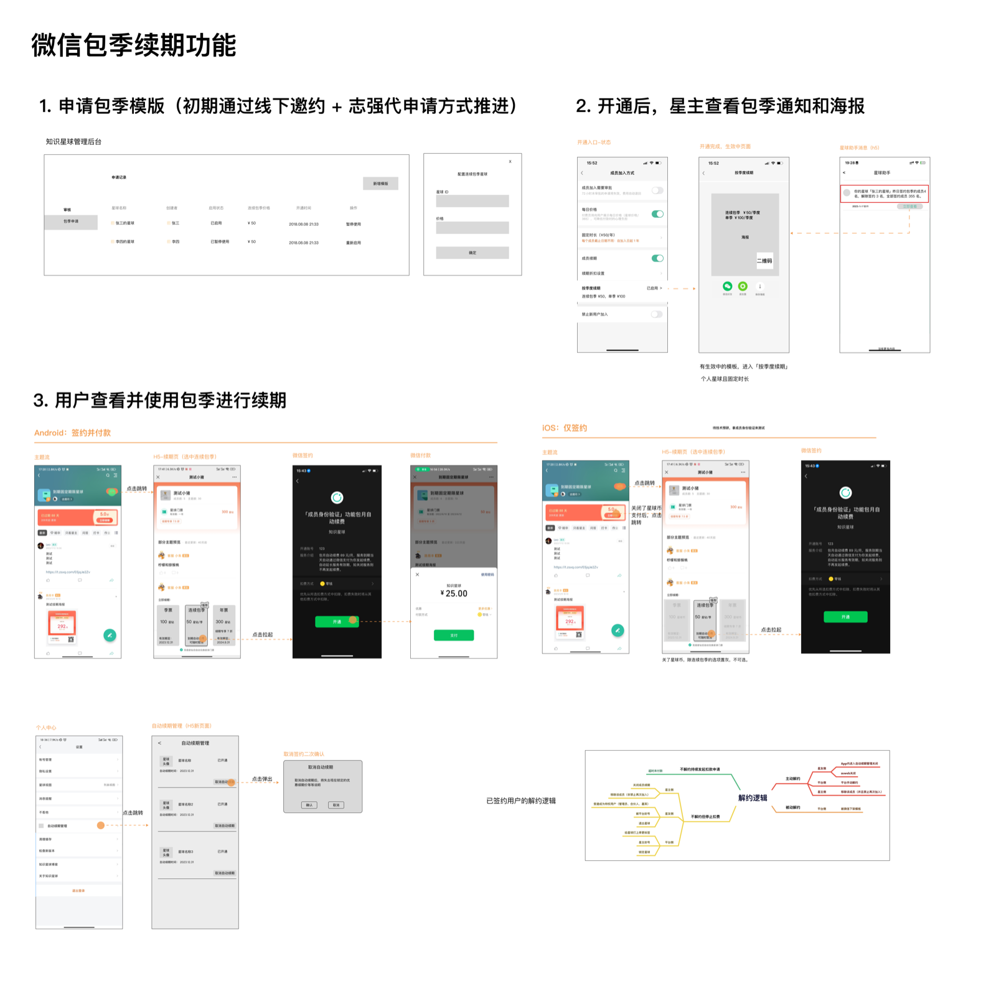

失败了，然后呢？

---

# 失败

> Ever tried. Ever failed. No matter. Try again. Fail again. Fail better.
> 曾经尝试。曾经失败。没关系。再试一次。再失败。失败得更好。
>
> —— Samuel Beckett

> Success is not final, failure is not fatal: it is the courage to continue that counts.
> 成功不是终点，失败不是致命的：重要的是继续前进的勇气。
>
> —— Winston Churchill

## 失败是常态

约 90% 的初创企业最终会失败。10% 在第一年夭折，70% 在第二至第五年间倒下。

这个数字听起来吓人，但换个角度看：如果你创业失败了，你和 90% 的创业者站在一起。失败不是耻辱，是创业的常态。

硅谷有句话：如果你没失败过，说明你不够努力。这话有点矫情，但道理是对的——创业本质上是在不确定中探索，探索就会走错路。

问题不是“会不会失败”，而是“怎么失败”。

有些失败让你学到东西，有些失败白白浪费时间。有些失败是探索的代价，有些失败是愚蠢的代价。目标不是不失败，而是失败得有价值。

## 好的失败与坏的失败

好的失败比较单纯：诚实地探索，输了认输，学到东西。

你有一个假设，做了验证，发现行不通。成本可控，没有把别人拖下水。对员工、投资人、合作伙伴有交代。失败后能说清楚为什么，下次怎么改。大多数创业失败属于这一类——不是你蠢，是市场没准备好，或者时机不对，或者产品和需求错位。

### 功能的失败

下面是知识星球内部一个真实的提案，上线后数据不佳，最终下线。

---

### 包季续费功能

作为星主，我希望做续费宣传的流量减少浪费，以便于提升续期率。

| 干系人 | 影响值 | 信心度 | 容易度 | 总分 |
| --- | --- | --- | --- | --- |
| lzq | 3 | 4 | 1 | 8 |

**问题**

星主做续费宣传时，流量浪费严重。发一篇续费文章，大部分读者还没到续费期，看了也不会付款。真正需要续费的用户，可能根本没看到。

**方案：微信包季续费**

用户签约后，每季度自动扣款，星主不用反复宣传。

功能设计分三步：

1. 申请包季模版。初期通过线下邀约，由产品经理代申请的方式推进。
2. 开通后，星主查看包季通知和海报。
3. 用户查看并使用包季进行续期。

**牌桌讨论**

邀请对象，取决于我们的目的。可以考虑邀请一些续期率中等或者比较好的星主。

首批邀请内测的星主，建议选择续费率中等偏上的。分享的海报，要尽量做的更有吸引力一点，比如强调首次开启季度续期等，目前的海报文案有些平淡。在用户选择续期的界面上，可以考虑通过 UI 的手段，淡化购买单季的选项。

**结果**

功能上线了。数据不佳，无法放量。最终下线。

---

这个提案经历了完整的流程：前期预研、方案设计、研发落地。问题是真实的，方案是完整的。但上线后，签约率低，续费率没有明显提升，星主使用意愿不强。尝试了几轮优化，数据依然推不动。

这是一个好的失败。

好在哪？验证是快速的，没有拖着消耗资源。止损是果断的，数据不行就撤，不恋战。失败后能说清楚为什么：用户对“自动扣款”有心理障碍，担心忘记取消；星主对“包季”的价值感知不强，觉得和单次续费差别不大；整个功能的使用路径太长，转化漏斗层层流失。

这些认知，是做之前想不到的。做了才知道。

### 产品的失败

2021 年，我们做了星空问答。当时的判断是：这件事可以做十年。在“产品评估”一章里，我详细讲过星空问答为什么没做起来。这里想讲另一件事：怎么收场。

产品做了一年多，数据推不动。我心里清楚情况不好，但一直没下决心停。毕竟是自己主导的项目，投了人力和时间，说停就停，面子上过不去。

后来在一次内部讨论里，有同事顶着压力说了一句：“如果找不到新的突破口，我建议关闭。”老板说过这事要做十年，他还是说了。这句话点醒了我。

我们决定停掉星空问答。同事提议在 TGIF 上专门聊这次失败，还给大家订了吃的，“庆祝”失败。我做了个简短的分享：为什么当初决定做，一年后数据怎样，为什么决定停。

段永平在哲库关闭后说过一句话：改正错误越早越好，不管多大的代价，都是最小的代价。我们能成为我们，不光是因为我们做过的那些事情，很重要的一部分是我们不做或者停止做的那些事情。

星空问答是一次好的失败。不是因为结果好，是因为收场的方式对。及时止损，坦诚复盘，没有把团队拖进一个看不到头的泥潭。

其实星空问答只是我们众多失败中的一个。从最早的漏洞扫描器“游刃”，到电子文档安全软件“铁卷”，到超级巡警、小白软件管家，再到 72 小时、侃图、小看板，再到后来的海外项目，二十年下来，失败的产品远比成功的多。

独立开发者 Pieter Levels 公开说过，他做了 70 多个项目，能算做成的只有 4 个，成功率不到 5%。

大多数产品会失败。这不是悲观，是事实。接受这个事实之后，心态反而会轻松一些：你不需要每次都对，你只需要做对一次。

再往上一层，是公司的失败。功能失败了，产品还在。产品失败了，公司还在。但公司失败了，所有人都要重新开始。

### 坏的失败

坏的失败比较复杂。

最常见的是拖累他人。公司不行了，欠着供应商的货款，拖着员工的工资，让上下游跟着倒霉。创始人可能没有恶意，但结果是把风险转嫁给了别人。

也常见的是不负责任。明知道撑不下去了，还继续招人、签合同、收客户预付款，把更多人拖下水。或者公司快倒闭了，创始人玩消失，不跟员工交代，不跟投资人沟通，留下一地鸡毛让别人收拾。

还有傲慢和失控。WeWork 曾估值 470 亿美元，创始人用公司的钱买私人飞机，投资自己的房产。公司不是倒在市场竞争上，而是倒在管理混乱上。

最极端的是欺诈。Theranos 的创始人伪造血液检测数据，号称“一滴血检测 200 多种疾病”，实际上机器根本不工作。这不是商业失败，是犯罪。

硅谷流行“快速失败”的说法。本意是好的：快速测试假设，在烧光钱之前发现问题。但这个说法被滥用了。有人用它为糟糕的决策开脱——伤害了员工、浪费投资人的钱、损害用户利益，然后说一句“我们快速失败了，学到了很多”。

亚马逊内部有个说法：决策分两种，单向门和双向门。

双向门是可以回退的决定。走进去发现不对，退回来就是了。这种决定可以快速做，错了成本也不高。

单向门是走了就回不来的决定。比如关掉公司、解散团队、签了不可撤销的合同。这种决定要慎重，因为一旦走错，没有退路。

好的失败，通常发生在双向门里。你快速尝试，发现不行，退回来换个方向。成本可控，学到东西。

坏的失败，往往是在单向门前没想清楚就冲进去。或者把本来可以是双向门的事情，因为拖延、傲慢、不负责任，变成了单向门。

好的失败和坏的失败，区别不在于结果，而在于过程：你是诚实探索还是骗人？是尽力止损还是把别人拖下水？是负责任地收场还是一走了之？

## 泥潭

不是所有失败都会立刻倒下。有一种状态比倒闭更难受：陷在泥潭里，不上不下。

公司还活着，每个月有收入，能发工资，但没有增长。不能说失败，因为还在运转。也不能说成功，因为看不到希望。

我自己经历过这种状态。

2005 年到 2014 年，我做防泄密软件，做了将近十年。公司能养活七八十人，不算小了。从媒体上看，泄密事件频发，国家陆续出台法规，大企业开始重视信息安全。每年都觉得：市场快爆发了。

但爆发一直没来。我们能接到单子，但接不到大单子。能活着，但长不大。

这种状态就像鸡肋：食之无味，弃之可惜。放弃吧，公司还能运转，员工还指望你。不放弃吧，看不到突破的可能。

很多创始人陷在这种泥潭里出不来。原因通常是舍不得：舍不得之前投入的时间，舍不得已经建立的团队，舍不得“万一明年就爆发了”的幻想。

我最后离开，不完全是因为等不下去。而是 2014 年，iPhone 已经发布七年了，我越来越喜欢移动互联网，觉得再不入局就晚了。跟投资人商量后，把防泄密业务卖给了启明星辰，全力转向移动互联网。

回头看，那个决定是对的。但如果我没有看到更想做的事，可能还会在泥潭里再耗几年。

泥潭最可怕的地方在于：它消耗的不只是钱，还有时间和机会成本。创始人最宝贵的资源是时间，耗在一个没有爆发力的项目上，意味着错过其他可能性。

有时候，干脆利落地关掉，比半死不活地拖着更好。

## 什么时候放弃

放弃的时机，往往比坚持更难判断。

创业圈流传太多“再坚持一下就成功了”的故事。Airbnb 差点倒闭，靠卖麦片撑过来了。Amazon 亏损多年，最后成了巨头。这些故事让人觉得：只要不放弃，就有希望。

但还有更多“坚持到底还是失败了”的故事，只是没人讲。幸存者偏差让我们高估了坚持的价值。

没有标准答案。但回头看，每次我决定停掉一个项目，之前都有信号。只是当时不愿意面对。

最硬的信号是钱。账上还能撑多久，这个数字不会骗人。2018 年我们账上的钱不够一年开支，那段时间每天都在算。钱烧完再决定，你没有选择。钱还剩一点的时候决定，你还能选择怎么收场。

第二个信号是人。骨干开始走的时候，说明他们的判断已经变了。他们比你更早感知到问题，只是不好意思说。星空问答那次，同事顶着压力说出“建议关闭”，其实他心里想说很久了。

第三个信号是数据。改了定位，换了渠道，调了价格，什么都试过了，还是推不动。我们做 72 小时、做侃图的时候都经历过这个阶段。最难的是承认：不是方法不对，是这件事本身不成立。

还有一个信号，不在外面，在自己心里：你不再相信这件事了。每天在说服自己，而不是被事情本身驱动。我做防泄密软件的最后两年就是这个状态。嘴上说还有机会，心里知道该走了。

这些信号往往同时出现好几个。出现了不一定要马上放弃，但值得停下来认真想想。

我自己的问题从来不是放弃太早，而是放弃太晚。每一次回头看，都后悔没有更早行动。

## 如何体面地结束

决定放弃之后，还有一件事要做：体面地收场。

很多创始人在这一步做得很差。公司不行了，悄悄消失，不跟员工交代，不跟投资人沟通，留下一地鸡毛。这样做的后果是名声坏了，下次创业更难。

体面地结束，首先是对团队负责。

我在公司内部说过：账上要留够全员 N+1 的赔偿金额。这个数字每年都在变，因为团队在变，工龄在涨。但不管怎么变，这笔钱要留着。万一哪天公司黄了，对同事们好歹有个交代。

不是所有公司都能做到这一点，但至少应该尽早告诉团队真实情况，尽力给合适的补偿。

然后是对投资人负责。

主动沟通，不要躲着。投资人见过太多失败，他们能接受项目不行，但接受不了创始人玩消失。把情况讲清楚：钱花在哪了，为什么没做起来，还剩多少，打算怎么处理。坦诚比什么都重要。

对合作伙伴和供应商也一样。欠的钱想办法还，至少给个说法。跑路是最差的选择。

最后是对自己负责。

复盘一下：这次失败是怎么发生的？哪些是外部原因，哪些是自己的问题？学到了什么？不用公开发表，但自己要想清楚。失败不可怕，同样的错误犯两次才可怕。

体面地结束，不只是道德问题，也是实际考量。创业圈子很小，你的下一个合伙人、下一个投资人、下一个员工，可能就是这次打过交道的人。路要越走越宽。

## 失败之后的人

公司会倒闭，人可以重来。

2005 年，乔布斯在斯坦福大学毕业典礼上做了一次演讲，讲了三个故事，其中一个关于失败。

他 30 岁那年，被赶出了自己一手创建的苹果。他和沃兹尼亚克在车库里创办这家公司，花了十年把它做成一家 20 亿美元的企业。然后董事会站在了他请来的 CEO 那边，把他赶走了。他说，那是一次几近毁灭的打击，他甚至想过彻底离开硅谷。

但二十年后回头看，他说：“被苹果开除，是我人生中发生过的最好的事。成功的沉重感，被重新做回初学者的轻盈感取代了。对一切都不再那么笃定，却让我获得了自由，进入了人生中最有创造力的时期。”

离开苹果后，他创办了 NeXT，投资了 Pixar。NeXT 后来被苹果收购，他借此回归。Pixar 做出了《玩具总动员》，改变了动画电影。1997 年他重掌苹果，带领它成为全球最有价值的公司。

他在演讲里说：“有时候生活会给你当头一棒。不要失去信念。我确信，唯一让我坚持下来的，是我热爱我所做的事。你必须找到你热爱的东西。工作会占据你人生的很大一部分，唯一让自己真正满足的方式，是做你相信是伟大的工作。而做伟大工作的唯一方式，是热爱你做的事。如果你还没找到，继续找，不要将就。”

很多创始人把自己和公司绑得太紧：公司失败了，我就失败了。这很危险。公司是公司，人是人。公司可以关掉，人还要继续走。

有研究发现，创业失败过的人在就业市场上往往比没创过业的人更受欢迎。因为他们被认为有韧性、有资源整合能力、见过世面。失败不是污点，是资历。
