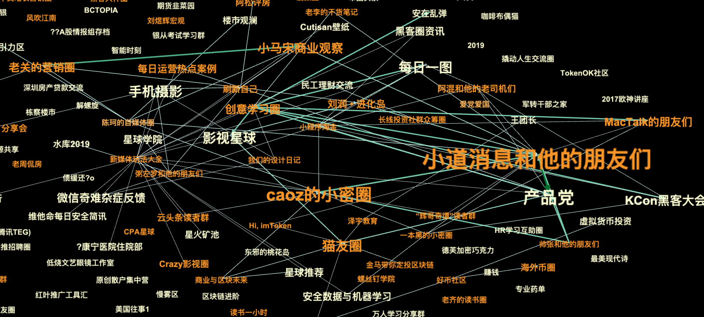

# 收入

> Revenue solves all known problems.
> 收入能解决所有已知的问题。
> —— Eric Schmidt

> Happiness is a positive cash flow.
> 幸福就是正向现金流。
> —— Fred Adler

小公司、小产品，先别想着做平台。

做平台需要两边撮合，需要规模效应，需要烧钱换增长。这条路太长了，大多数小团队走不到终点。

把姿态放低一些。想清楚一件简单的事：怎么让钱进来。

不是用户量，不是估值，不是市场份额。就是钱。有人愿意付费，说明产品有价值。钱能进来，说明生意能跑通。现金流正循环，公司才能活下去。

目标可以远大。但执行要一步一个脚印。先让十个人付费，再让一百个人付费。先活过这个月，再想下个季度。

用收入来验证产品，用付费来筛选用户。这是小团队最实在的生存法则。

## 先收钱

### 为什么要尽早收费

羊毛出在猪身上的模式没有死，但它需要海量用户，需要烧钱换增长，需要熬很多年。小团队玩不起这个游戏。

对小团队来说，尽早收费有三个好处。

第一，验证需求是不是真的。用户说“这个功能好”，和用户愿意掏钱，是两回事。免费的东西，谁都说好。付费才是真正的投票。有人付钱，说明你解决了真问题。没人付钱，趁早换方向。

第二，筛选认真的用户。免费用户什么人都有，很多人只是随便看看。付费用户不一样，他们花了钱，会认真用，会提有价值的反馈，会帮你传播。十个付费用户的价值，可能超过一千个免费用户。

而且付费用户的反馈更尖锐。一个付了高价的愤怒客户，比一个免费用户更可能告诉你哪里做得不好。免费用户不满意就走了，付费用户不满意会找你理论。这些理论，都是改进产品的线索。

第三，形成现金流正循环。有收入，就能活下去。能活下去，才能继续迭代。继续迭代，产品才会变好。产品变好，才有更多人付费。这个循环一旦转起来，公司就有了生命力。

一个做会议产品的朋友，早期纯免费，烧投资。产品不错，但没有正向现金流，一直烧到资金困难。后来做了个艰难的决定：收费。

有用户说他们“膨胀了”。但收费之后，当年收支就打平了，第二年有了利润，还拿到了新一轮融资。

他有个感慨：最早想的是，我提供产品给机构用，机构好歹给我们带来了用户，我再收钱，不合适。后来再看，机构需要我们的产品，来给他们的用户提供服务，并通过我们，赚到更多钱。我们是他们赚钱的一个好工具，好帮手。这种情况下，合理收费，才是多赢。

收费不是终点，是起点。有人付费，你才知道方向对不对。

### 免费的陷阱

很多人想：先免费，把用户圈进来，以后再收费。

这个想法很自然，但有个陷阱：免费用户很难变成付费用户。

原因是心理锚点。用户第一次接触你的产品时，如果没付费，他的认知就定在了“这是个免费的东西”。免费的东西，潜台词是“不值钱”。之后你再想收费，他会觉得你变了，而不是觉得产品值这个价。

知识星球早期支持免费、付费互转。我们观察数据后发现：一开始免费进来的用户，不管星球内容多有价值，基本上完全浪费了。他们不会续费，不会贡献内容，甚至不会再来看。第一次没付费，心理认知就是“这是个没价值的地方”。

后来我们砍掉了免费转付费的功能。

有朋友问：我想先免费导一批用户进来做 UGC，等内容丰富了再收费，行不行？

我说不行。如果想低门槛获客，用优惠券，别用免费。优惠券是“打折”，用户的认知是“我占了便宜”。免费是“不要钱”，用户的认知是“本来就不该要钱”。一字之差，心理完全不同。

免费还有另一个陷阱：让团队失去判断力。

在寻找 PMF 的关键阶段，免费会让团队丧失敏感度。免费用户什么反馈都有，真需求、伪需求混在一起，根本分不清。团队在噪音里打转，方向越走越偏。

付费是过滤器。愿意掏钱的用户，需求更真实，反馈更有价值。从付费用户的反馈里，团队能看清方向，练出真本事。

免费不是低门槛，是错误的起点。

## 收费模式与定价

### 付费模式

常见的付费模式有这几种：

订阅制。按月或按年收费，用户付费才能使用。SaaS 产品最常用这种模式。优点是收入可预测，现金流稳定。缺点是用户决策门槛高，需要先说服他“值得长期用”。

交易佣金。用户免费使用，平台从交易中抽成。知识星球收 5%，Patreon 收 5%-12%，OnlyFans 收 20%。优点是用户零门槛进入，平台和用户利益绑定。缺点是收入依赖用户的交易量，头部用户可能觉得抽成太贵。

一次性买断。付一次钱，永久使用。传统软件常用这种模式。优点是用户决策简单，付完就完。缺点是没有持续收入，需要不断获取新客户。

按用量付费。用多少付多少。云服务、API 产品常用这种模式。优点是用户按需付费，门槛低。缺点是收入波动大，用户用得少你就赚得少。

Freemium。基础功能免费，高级功能付费。很多工具产品用这种模式。优点是用户容易进来，用着用着就想升级。缺点是免费用户可能永远不付费，白占资源。

没有完美的模式。关键是匹配。

你的产品是什么形态？用户是谁？他们习惯怎么付费？toB 用户习惯订阅制，toC 用户可能更接受按次付费。高频使用的产品适合订阅，低频使用的产品可能买断更合适。

小鹅通用订阅制，起步价 5000 元。知识星球用佣金制，起步价是零。两种模式各有取舍：订阅制筛掉了付不起钱的用户，但也筛掉了愿意尝试的用户；佣金制让所有人都能进来，但头部用户可能觉得抽成不划算。

OnlyFans 收 20%，听起来很高。但去年它靠这 20% 赚了 4 亿美元，基本没有内容成本和营销成本。创作者愿意付这个比例，因为平台帮他们解决了支付、分发、隐私保护这些麻烦事。

选模式之前，先想清楚你能为用户创造什么价值，然后选一个让双方都能接受的分配方式。

### 帮用户赚钱

如果你的产品能帮用户赚钱或省钱，定价就有了锚点：从用户赚到的钱里分一杯羹。

知识星球帮星主卖课、卖圈子，星主赚到钱，我们抽 5%。AfterShip 帮电商追踪物流，减少客服成本，省下的钱里收一部分。Stripe 帮商家收款，每笔交易抽手续费。

AfterShip 的创始人 Teddy 有个定价基准：收费大约是帮用户赚到或省下的钱的 10%。用户算账能算得过来，你也能赚到钱。

这个逻辑的好处是，你和用户的利益绑在一起。你帮他赚得越多，你赚得越多。他会希望你活下去，甚至希望你涨价——因为你涨价意味着你能提供更好的服务，他能赚更多。

知识星球早期收 5%，行业里绝无仅有的低。有星主说：可以再高点，知识星球做好了，我们才会更好。这就是利益绑定的效果。

但这个思路有适用范围。如果你的产品不直接帮用户赚钱或省钱——比如笔记工具、娱乐产品、效率工具——定价逻辑就不一样了。那时候你卖的是体验、是时间、是便利，得找别的锚点。

### 关于涨价

涨价很难。但有时候必须做。

知识星球早期收 5% 佣金，行业里绝无仅有的低。我们算过账，团队精简，成本控制得住，低价能跑通。低成本、低利润，用户量起来了，就有更多可能性。

但后来遇到了问题：合规成本上升，这部分没法再自己扛了。2019 年，我们宣布调整：个人星主的扣除比例从 5% 变成 20%，企业星主保持 5% 不变。

消息发出去，反应两极分化。

有人支持：“很良心了，可以再高点，知识星球做好了，我们才会更好。”

有人反对：“疯了啊！开始割韭菜了！此处不留爷，自有留爷处！”

还有人理解但担心：“合规是好，只是估计对知识星球的伤害会有些大，保重保重。”

涨价那几天压力很大。但结果还好，大部分用户留下来了。事后看，真正因为涨价走的人很少。愿意付费的用户，在乎的是价值，不是那几个点的差异。

涨价的经验：

第一，涨价要有理由。我们的理由是合规，用户能理解。如果只是“我想多赚点”，很难说服人。

第二，提前沟通。不要突然涨价，给用户时间消化。我们提前发公告，解释原因，留了缓冲期。

第三，接受会有人离开。涨价一定会流失一部分用户，这是代价。但留下的用户质量更高，关系更健康。

低价是竞争力，但太低活不下去。定价要让自己能持续服务，这才是对用户负责。

## 小也能活

### 小池大鱼

小团队不要去大市场抢蛋糕。主动选小，是策略。

算一笔账：10 亿的小市场拿 50% 份额，是 5 亿。100 亿的大市场抢 5% 份额，也是 5 亿。收入一样，但难度天差地别。大市场有巨头、有资本、有成熟玩家，你进去就是炮灰。小市场没人看得上，你进去就是老大。

《小池大鱼》这本书讲的就是小林制药的经营方法论。

基于这样的策略，毛利率是一个非常重要的判断指标。尽量避免开发预期毛利率较低的新产品。增收固然重要，但依靠以增利为重心的经营体制才使公司得以成长壮大。

为了保证高毛利率的新品开发，需要设置一定的数字门槛，如果达不到一定数值就要做好放弃的心理准备。

在决定大规模发售之前，不会增加新的生产设备。充分利用现有设备，有时也会通过手工作业来实现快速的小批量生产，然后在市场上进行试销。如果试销效果不理想，就会放弃扩大生产。只有在取得良好的试销结果并决定扩大销售之后，才会进行新的设备投资。

做一点，卖一点，再多做一点。

### 小众未必小

很多人不敢选小路，是怕市场太小养不活自己。

但你以为的小众，算一算，未必小。

泛二次元看起来小众，但有 3.5 亿人。购买力弱，付费意识却强。玄机科技前十年只做一部作品《秦时明月》，十年磨一剑，后续的商业回报是巨大的。

播客听起来小众，但中文播客用户超过一亿。小宇宙做播客 App，看起来是个小生意，但它在这个“小众”市场里站稳了脚跟。

机械键盘是小众爱好，但全球市场规模超过 10 亿美元。一把键盘几百上千块，用户愿意为手感和颜值付费。一个小团队做客制化键盘，养活自己绰绰有余。

小众不等于小市场。小众意味着人群聚焦、需求明确、付费意愿强。这些特点对小团队来说，反而是优势。

### 长期和小也是护城河

大公司看不上的生意，就是小团队的护城河。

护城河不一定是技术壁垒、规模效应、网络效应这些“高大上”的东西。还有一种护城河：市场不够大，利润不够高，看起来辛苦。大公司算完账，觉得不值得做。这就是你的机会。

知识星球就是这样。第一眼看，好像是平台生意。稍微一分析，会发现其实只是工具，收入没有想象中高，用户粘性没有想象中强。再和业内人士聊聊，会发现内容生意在国内风险高、投入大。

大公司看完，不感兴趣。创业公司看完，觉得不性感。但这恰恰是我们能活下来的原因。

做小工具，我往往喜欢找这样的方向：

- 我自己要用的。自己有体感，天天用，才能最好地改进
- 落点够小的。足够小，团队的能力才够得着，MVP 不会那么久
- 市场第一眼也不太大的。没太多争抢的意思
- 我自己盘算着，值得长期做的。就算商业上不划算，刷自己的卡养着都愿意

小，让别人看不上。长期，让你越做越深。这就是小团队的护城河。

### 一个人也能活很多年

BuiltWith 是一个查看网站技术栈的工具。输入网址，告诉你这个网站用了什么服务器、CMS、分析工具、广告网络。2007 年，澳大利亚程序员 Gary Brewer 业余时间做的，一个人开发运营至今。2024 年年收入 2260 万美元。

Gary 极度厌恶管理。VC 的电话每周都有，他全都忽略。他觉得跟 VC 聊天是浪费时间。他把自动化做到极致，大部分客户问题通过知识库在 10 秒内解决。

一个人的产品，也能活很多年，也能赚很多钱。

一个人能活，小团队更能活。

Gumroad 是一个创作者销售平台，帮创作者卖数字产品。2023 年收入 2700 万美元，净利润 890 万美元。更有意思的是，这家公司没有全职员工，全都是兼职。

他们的运营方式很独特：公司没有晋升通道、没有完善的福利、不提供医疗保健、不提供电脑和手机等设备。每个人的薪水和工作时间透明。每周最多工作 20 小时，超过之后时薪降到一半。很多工作人员本身就是用 Gumroad 赚了钱的创作者。

Gumroad 的目标很简单：让创作者赚更多钱。公司里每个人都用这个标准来判断一件事值不值得做。他们衡量成功的方式也很直接：看未来几十年的现金流，而不是估值、融资额这些虚的东西。

不追求规模，不追求增长，只追求活着，活得久。这是另一种成功。

