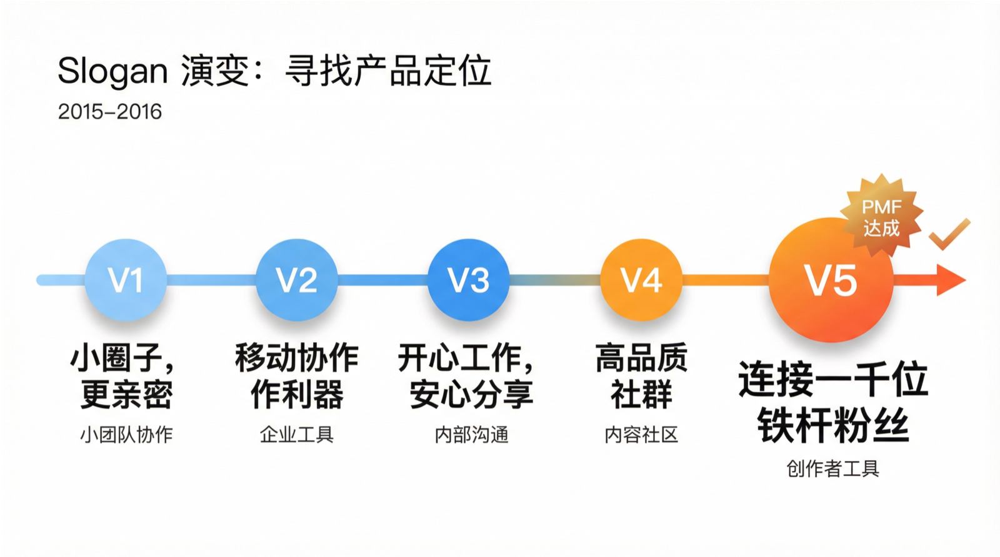

增长为什么迟迟不来？

---

# 非线性发展

> How did you go bankrupt? Two ways. Gradually, then suddenly.
> 你是怎么破产的？两种方式。慢慢地，然后突然地。
>
> —— Ernest Hemingway,《太阳照常升起》

> Luck is what happens when preparation meets opportunity.
> 运气是准备遇上机会。
>
> —— Seneca

体验了攀岩，在下面看很简单，真上去了，经常发现抓不到下一个点，或者体力不支，掉下来。

创业也是这样。产品的 PMF 就是落脚点，现金流决定你能撑多久。你不知道下一个点在哪，只能一边攀爬一边找。

乔布斯说 connect the dots，指的是事后回看，才能把点连成线。身处其中时，只能相信这些点终将连接。

## 平淡期是常态

知识星球在 Fenng 推荐之前，经历了近两年的摸索。但如果把时间线拉长，这段摸索期其实更久。

2007 年乔布斯发布 iPhone 时，我还没意识到它会改变世界。到了 2010 年，我迷上了手机上的各种软件，很想在移动端做点事情。但当时经营着一家 To B 的企业安全软件公司，分身乏术，一直没能转向。

2014 年底跟股东商量，想要彻底转型。腾讯在我们毫无移动互联网经验、没有移动开发和运营团队、没有方向的情况下，投了 3000 万。启明星辰则把我们的信息安全产品和团队收购接管，让我们可以全力学习新方向。

刚开始试水的时候，毫无头绪。

最早做了个叫“72 小时”的产品。考虑到我们做安全、加密的技术背景，做了个“既分享，又保密”的 App：文件发给对方，对方能看但不能保存、截图，指定时间内自动销毁。设想的目标用户是有保密需求的商务人士。

很快发现，发送机密文件这个场景太低频，用户平时用不着，用时想不到。反而意外发现有一小批年轻用户来互发图片，深夜是使用小高峰。虽然我们从设计机制上就看不到文件内容，但猜测大概是些尺度比较大的照片。

既然有图片社交需求，那就做图片社交——这就是“侃图”。摄影师拍照或选图上传，其他人弹幕点评。产品虽然用心，起步可能就错了：国内用户的图片，那时基本都被微信朋友圈和微博吃掉了。有一些用户，数量不多，活跃不够。

最早的“小密圈”这个名字，其实是想做加密云盘的。不过还没启动就切换方向了。契机是一次向 Tony 请教时，他提到：在公司内部既要畅所欲言，鼓励大家分享讨论，又要保证信息安全，两者兼顾非常困难。

于是我们把小密圈定位成小团队协作工具。迭代几个版本后发现了残酷的现实：大多数项目经理不觉得这个工具有价值，少数认为有价值的，在内部推动也不顺畅。

产品界一直推崇自己的产品必须自己先能用好。我们团队尝试用小密圈来做内部管理，使用下来发现，信息流的产品形态确实不适合管项目。于是又启动了新项目“小看板”——看板式管理。没有扎实的需求调研，团队对看板式管理也不了解，一拍脑袋就做了决策，毫无意外地又失败了。

从小密圈的 Slogan 变迁，可以看出定位变化的历程（图 24-1）：

- V1：小圈子，更亲密
- V2：移动协作利器
- V3：开心工作，安心分享
- V4：高品质社群
- V5：连接一千位铁杆粉丝

前三个版本都不温不火。市场上替代品太多，用户没有非用不可的理由。

转机来自一次和 Fenng 的聊天。他当时在运营“小道通讯”——一个付费邮件列表，跟我吐槽管理时的各种难受：

- 订户通过微信或支付宝付款，他需要手动做表格增删，有时有人付了款但没留邮箱，又得花时间寻人
- 邮件到达率、打开率都不高
- 有人抱怨某免费邮箱根本没收到邮件，一查，发现被退订了——但用户没执行过退订。原因是：该邮箱对邮件里的链接做安全检查，邮件列表提供商在邮件里有个快速退订链接，点击后无需确认立即退订。两个特性碰一起，用户就被退订了

那时候我们想到，可以调整小密圈的方向，做连接头部 KOL 和订阅者的工具——为有创作能力、有粉丝、爱分享的人提供工具。

这就是平淡期的真实状态：不是生死时速的选择，而是持续的迷茫和调整。没有清晰的信号告诉你对还是错，只能多试几次，多输几次。从 2014 年底决定转型，到 2016 年底找到方向，整整两年。

## 机会是非线性的

增长往往不是线性的（图 24-2）。

Fenng 试用了新版本之后，把他创建的星球发到了微信公众号和微博。

这里有个掉链子的事：他前三次把星球信息分享出去时，带来的访问都让我们的业务崩了。我们确实是从毫无经验开始，跌跌撞撞地成长。

但机会来的时候，是突然的。2016 年底，Fenng 在微博推荐了小密圈，隔天又在公众号推了两次。从那天开始，连锁反应就停不下来了。

内容创作者听说了知识星球，开始尝试使用，把星球公开发布给粉丝，挣到了一些收入，有了正反馈。他的朋友和用户看到这个正反馈，也开始尝试。小小的雪球就开始滚动起来。

随之而来的是一堆事情同时砸过来：

- 产品里还有很多细节没雕琢好
- 大 V、KOL 进来时，我们连给他们看的说明文档都没准备好
- 付费用户多了，就有大量客服需求
- 流量新高，需要同时监控压力情况

更忙碌了，但看到有不止一个人在短时间内，在知识星球收入超过十万元，我挺开心的。

这就是非线性。机会来的时候，不是缓缓走来的，是突然砸下来的。

Tony 看了这个版本后说：

> 可以看到知识星球的星星之火了。知识星球的机制，巧妙地跟创作者站在一起。用户原来对 App 的耐心一般不超过 30 秒，现在因为这些知名创作者的背书，他们对知识星球的耐心从最初的 30 秒延长到了 10 分钟。你们继续深挖用户需求，做好魔鬼细节，如果用户能给知识星球更多时间，甚至愿意天天给，那就算站住脚了。

当机会来了，要尽力放大。对知识星球来说，每年所做的各种准备，都是为了能接住机会。

2025 年初，DeepSeek 突然爆火，带来了很多机会。那段时间知识星球也有内容的爆发式增长——流量突然暴涨之后，能不能接得住？服务器性能跟得上吗？产品体验跟得上吗？风控措施到位吗？这些决定了是一次性的热闹，还是增长后能稳住，乃至持续。

## 稳健与冲劲

既然机会是非线性的，那平时该怎么办？

有一年董事会上，我报了一个“稳健”的目标——跟上一年计划的目标保持一致，虽然上一年超额完成了。我的理由是：大环境不明朗，内容社区产品稳健比激进更重要；稳健的目标不会妨碍我们遇到机遇时冲一把；我不希望目标把动作压变形。

有一位董事提出，建议我思考如何打破目前的天花板。

这让我反思：我“稳健”的想法，是不是缺了点冲劲？

后来我想明白了：稳健和冲劲不矛盾，它们是不同阶段的选择。

产品有不同阶段，每个阶段的节奏不同：

- 起步期：暴风骤雨。产品从零到一，需要密集投入，快速试错。
- 探索期：两种状态。找到方向后全力冲刺；方向不明时低功耗试探，保存体力。
- 稳定期：两条腿走路。一支稳，核心业务保持迭代；一支快，另一支团队探索新方向。
- 维护期：低功耗。市场没有明显机会，团队需要休整。养精蓄锐比盲目消耗更重要（图 24-3）。

知识星球现在处于稳定期。我们的做法是：70% 精力在核心产品，20% 做实验，10% 探索新方向。

但 2017 年的知识星球不是这样。那时候刚找到 PMF，正是该冲的时候。我们全力以赴，没有太多 work-life balance 的讲究。那段时间的状态，是知识星球能活下来的原因之一。

同样是 2017 年，我们也学到了另一课：配好刹车再上路。那年因为内容安全问题，我们经历了媒体报道和监管约谈。这段经历在“风险控制”一章有详细讲述。教训很简单：不能因为一个用户、一篇帖子，导致全部用户无法使用。

一位前辈跟我说：活久点，别放弃。

这句话我记到现在。稳健不是没有野心，是知道什么时候该踩油门，什么时候该踩刹车。冲劲不是蛮干，是在对的时机全力放大。

不是所有增长都值得追。早期知识星球遇到过羊毛党——创建星球相互提问，信用卡支付后提现套利。表面上流水涨了，实际是无效数据和成本消耗。这个故事在“风险控制”一章有详细展开。有些机会，接住了反而会摔下去。

关键是识别信号。用户增长曲线突然变陡，某个功能的使用率异常上升，外部环境出现变化——这些都是信号。看到信号，判断是机会还是陷阱，然后决定是稳还是冲。

## 机会从哪来

回头看，那些点是怎么连起来的？

《创新者的窘境》里有个观点：追逐高利润，反而可能给对手让出市场空间。

> 理性的管理者很少能找到充分的理由进入规模小、需求不明确，而且利润率更低的低端市场。

破坏性技术的特点是：更简单、价格更便宜、性能更低、利润率更低。因此，也更难在成熟的公司里被支持。

这产生了一个重要的战略影响：低端市场形成竞争真空，吸引新兴企业参与竞争。

Notion 是一个典型案例。

2015 年，Notion 差点死掉。产品不稳定，用户不买账，钱快烧光了。创始人 Ivan Zhao 和 Simon Last 裁掉了仅有的几个同事，从旧金山搬到日本京都——因为那里生活成本低，能多撑一段时间。

他们在京都住了近一年，每天写十几个小时代码，吃泡面，从零重写了整个产品。

Notion 面对的是 Google 和 Atlassian 这样的巨头。Google 有 Docs、Sheets、Drive，但它们是分散的产品，从来没整合成一个统一的工作空间。Atlassian 的 Confluence 主导了企业 wiki 市场，但它复杂、面向工程师，普通用户用不起来。

这两家公司都有能力做 Notion 做的事，但它们的核心业务太赚钱了，没有动力去做一个“更简单、更便宜”的整合工具。

知识星球也是类似的逻辑。微信和微博都有能力做付费社群，但它们的核心业务是广告和流量分发，没有动力去做一个“小而垂直”的创作者工具。我们就在这个夹缝里活了下来。

非线性的机会，往往来自既有玩家看不上的地方。

事后回看，那些点连成了线。但身处其中时，只能一边攀爬，一边寻找下一个落脚点。没有人能提前画好路线图，能做的就是每一步都认真踩实，然后等待那个突然到来的时刻。
