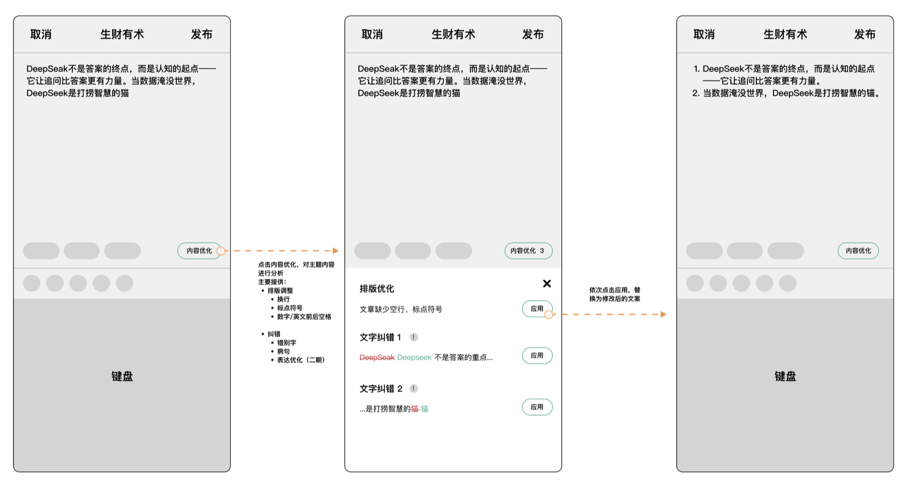
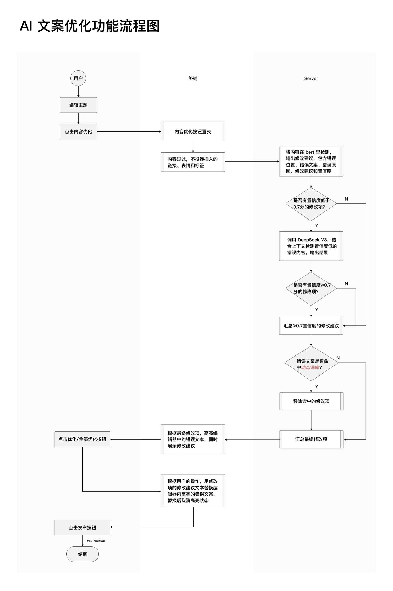
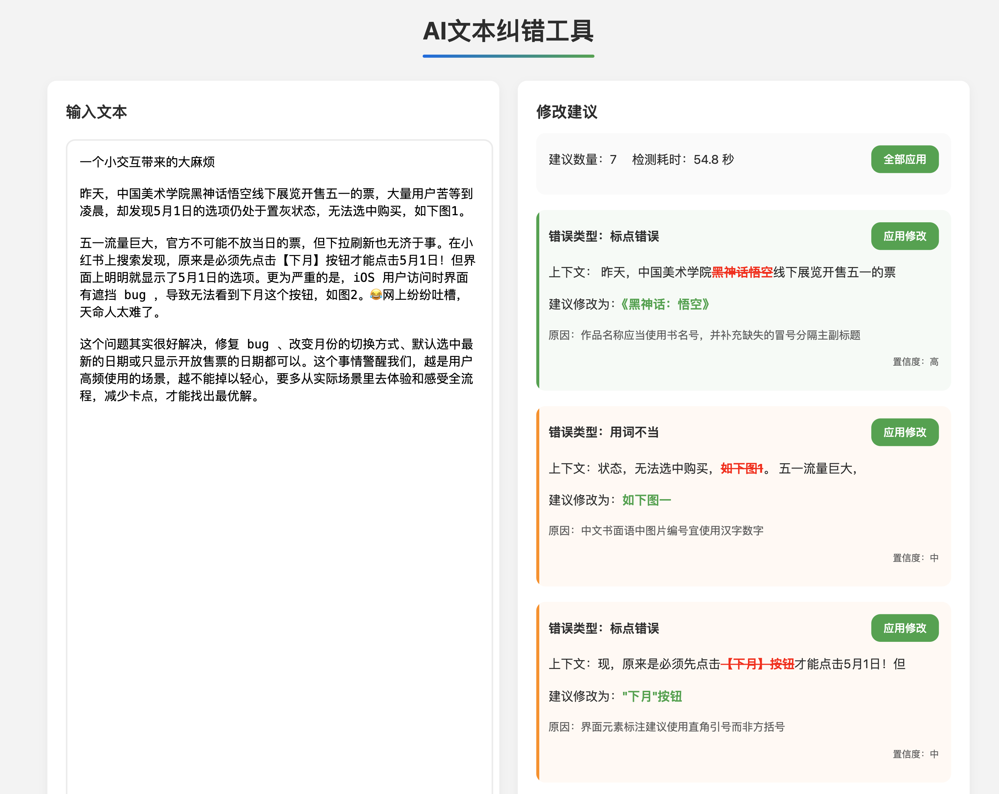

# 提案

> 完美不是无可增添，而是无可删减。
> —— 安托万·德·圣埃克苏佩里
>
> 如果大家一致同意，这个决定就不该做。
> —— 阿尔弗雷德·斯隆

todo：
- 补充一个内部提案的例子
- 补充两个反例

> 好的律师事务所训练刚从法学院毕业的新人，会安排他们先站在对方律师的立场上写辩护词，因为对方律师一定会维护其委托人的利益。知彼才能更好地知己。有效决策者不会预设大家提出的行动路径只有一条是对的，其他的都是错的。他也不会预设“我是对的，他是错的”。他预设的是一定要弄清人们为什么会有不同意见。
>
> ——卓有成效的管理者

---

## 为什么需要提案

写提案是个梳理思路的过程。

不仅是为了说服别人，也是为了说服自己。你得先站在反方立场想一遍：这事为什么不该做。想清楚了，才知道该怎么做。

写提案也是个信息对称的过程。没有提案，每个人脑子里的边界都不一样。有人觉得要做完整，有人觉得够用就行。

网页版知识星球需要加快捷键功能。我想要的是一个快捷发表，产品经理设计出来的是一整套：键盘导航、创建新主题、发表主题、发表评论，一系列功能。

产品牌桌上我问：“这要花多少时间？”
“大概三到五人天。”
“我只需要快捷发表，一人天能做完吗？”
“可以。”

如果一开始就有提案，写清楚：我想用一人天做一个快捷发表功能。产品经理就不会设计得那么完整。

这是典型的 Appetite（胃口）缺失。没有时间约束，产品经理会本能地把功能做完整、做理想化。这不是产品经理的错，是产品提案没说清楚边界在哪。

没有时间边界，功能就会膨胀。没有场景边界，规则就会打补丁。没有问题边界，设计就会反复推倒重来。

小团队最贵的成本是时间。返工的成本是做两遍。

提案不是为了保证成功，是为了避免：产品经理设计了一堆不需要的功能，研发花了三倍时间，最后发现做错了方向。

提案还有另一个更重要的价值：让反对的声音提前出现。

2018 年，我们想做一个“广场”功能，让用户发现感兴趣的知识星球。负责产品的同事拿着设计稿上牌桌，说要做分类、搜索、排序三个模块，预计两周。

我问：“怎么让用户发现好内容？”
“靠分类和搜索。”
“没有推荐算法？”
“不做。做推荐要时间，先把基础功能上线。”

研发的同事听完，直接说：“如果这样的版本，解决了什么问题？用户为什么要用？”

会议室安静了几秒。负责产品的同事说：“那你觉得应该怎么做？”

研发同事：“要么就投入资源，好好把推荐功能做好，要么就别做这个功能。现在搜索功能已经能搜到星球了，再做个一样的，有什么意义？”

提案在会上被否了，节省了至少两周开发时间。原因是：我们没想清楚这个功能的核心价值是什么。如果只是分类和搜索，现有的搜索功能就够了。如果要让用户发现好内容，不投入做推荐，体验必然很差。

提案的目的不是一定要通过。是让团队看清楚：这个方案哪里不对，为什么不该做。好的提案会把风险暴露出来，让反对意见在动手之前就冒出来。这比做到一半发现不对，要便宜得多。

## 如何写好提案

写提案之前，先问自己：为什么不该做这件事。

“稍后阅读”功能，为什么不该做？可能的理由：

- 用户量不够大。如果只有 1% 的用户会用，不值得做
- 现有功能够用。收藏功能虽然不完美，但勉强能解决问题
- 维护成本高。加一个列表容易，但后续会不断有优化需求

想清楚这些反对理由，再决定做不做。如果反对理由站不住脚，这个提案就值得推进。如果反对理由很充分，那就别做了。

好的产品经理会站在反方立场想一遍。想不出反对理由，说明想得不够深。

提案里的解法，用草图说明，不要用高保真设计稿。

“稍后阅读”的提案，可以画个简单示意图：内容详情页哪里加按钮，列表页长什么样。用线框图就够了，不要标颜色、字号、间距。

过度指定会限制设计师发挥。你规定了按钮是蓝色，设计师就不会想是不是该用其他颜色。适度模糊反而能激发更好的方案。

提案的目的是说清楚“做什么”，不是规定“怎么做”。

写提案是为了做减法。

一开始想做“稍后阅读”，写着写着发现可以顺便加个标签功能，又发现可以加个笔记功能，最后变成了一个知识管理工具。

提案逼你在动手之前就划边界。写“不做什么”的时候，你会意识到：这些功能虽然好，但不是这次要解决的问题。

真正有用的提案，不是写给老板看的，是写给自己用来做减法的。

## 提案的五个要素

一个完整的提案需要回答五个问题。我用知识星球的一个真实提案来说明。

2019 年，用户反馈说想要一个“稍后阅读”功能。看到一条有价值的内容，想先收藏起来，晚点再看。

**问题（Problem）**

用户会在时间线里看到很多内容。有些内容很长，当下没时间看完，但又怕刷过去就找不到了。现在只能截图保存，或者用系统的收藏功能，但收藏是为了长期保存，不是为了“稍后阅读”。

问题要具体。不要说“用户需要收藏功能”，而要说清楚用户在什么场景下遇到了什么困难。

**胃口（Appetite）**

我想用一人天做这个功能。

时间约束就是设计约束。说“一人天”，团队就知道不能做得太复杂。不能做文件夹分类，不能做标签，不能做搜索。

在我们团队，胃口分三档：
- S：一人天左右
- M：三人天左右
- L：五人天左右

**解法（Solution）**

在内容详情页加一个“稍后阅读”按钮。点击后，内容会进入一个单独的列表。这个列表按时间倒序排列，最新加入的在最上面。

看完后可以划掉，也可以不管它。三个月后自动清理。

解法要恰到好处。不是完整的交互设计稿，但也不是一句空话。要说清楚核心交互，但留给设计师发挥空间。

**陷阱（Rabbit Holes）**

不要做标签和分类。一做就停不下来，会变成一个笔记管理工具。

不要做提醒功能。用户什么时候看，是用户自己决定的，我们不要打扰。

陷阱是那些看起来合理、但会让时间失控的细节。提前标出来，避免团队在实现时走偏。

**不做什么（No-gos）**

不支持导出。不支持分享。不支持笔记。

这是边界。告诉团队：这个功能只解决“稍后阅读”这一个问题，别的都不做。

这五个要素串起来，就是一个完整的思考过程：我们要解决什么问题，愿意花多少时间，用什么方案解决，哪些坑要避开，哪些功能不做。

写提案就是逼自己把这五个问题想清楚。

## 如何带着提案开牌桌会

产品牌桌会容易开成两种样子。

第一种是产品经理拿着三个方案上台：“方案 A 是这样，方案 B 是那样，方案 C 是另一种。大家觉得哪个好？”

这种会开不出结果。老板要么选一个自己喜欢的，要么让产品经理回去再想想。产品经理没有观点，就是让老板替自己做决策。

第二种是产品经理拿着一堆细节上台：“这个按钮放左边还是右边？这个文案写'确定'还是'提交'？这个颜色用蓝色还是绿色？”

这种会更糟糕。一个小时过去了，只讨论了两个提案，后面的都挤掉了。

好的牌桌会应该是：产品经理带着一个最佳方案上台，说清楚为什么这个方案对。老板和团队挑战这个方案，找出问题，一起把方案改得更好。

具体怎么开？

提案要有基本格式。至少包括前面说的五个要素：问题、胃口、解法、陷阱、不做什么。简单的提案，每个要素一句话就够了。复杂的提案，可以多写几段。

但格式要统一。不能有的提案写了三页，有的提案只有一句话“我想做个分享功能”。

产品经理要有明确观点。拿一个方案上台，不是拿三个方案让大家选。你是产品经理，你应该知道哪个方案最好。如果你自己都不知道，别指望会上能讨论出来。

会议要控制节奏。提案讨论超过 15 分钟还没结论，要么是提案没想清楚，要么是分歧太大。这时候不要继续讨论，先放一放，会后单独聊。

牌桌会不是为了通过所有提案，是为了找出不该做的。能砍掉一半提案，这个会就开得值。

## 一个完整案例

下面是知识星球内部的一个真实提案，包含了提案本身和团队讨论的全过程。

---

### AI 辅助内容纠错

#### 一、需求描述

在用户编辑主题时，通过 AI 审查用户输入的内容，给出优化建议，用户可以一键应用具体的优化，自动修改内容。

#### 二、功能范围

- 格式优化
  - 标点符号
    - 中文标点规范（全角/半角）
  - 换行
  - 段落缩进
  - 数字/英文前后空格
  - 数字单位（"万/萬"）等格式的识别能力
  - 序号（二期再考虑）
- 错别字
- 近义词
- 同音字、形近字、多音字
- 语义问题
- 表达优化（二期再考虑）

#### 三、需求设计



- 可视化标注：采用类似 Grammarly 的红线下划线交互，对错误类型做颜色区分：
  - 红色：确定性错别字
  - 黄色：疑似格式问题
  - 蓝色：表达优化建议

- 判断逻辑
  - A[用户输入] --> B{动态词库匹配}
  - B -->|命中| C[直接应用白名单规则]
  - B -->|未命中| D[DeepSeek V3 API调用](检测头：错别字/格式定位)(置信度头：概率预测)
  - D --> E[错误位置标记][置信度分数]
  - E --> F[根据人工规则，自动过滤掉低置信度分数的建议]

- 动态词库

```
{
  "绝绝子": {
    "type": "网络用语",
    "meanings": ["非常棒", "令人震惊"],
    "context": ["褒义", "感叹"],
    "weight": 0.95 # 白名单权重
  },
```

- 置信度分级策略

| 置信度区间 | 渲染方式 | 用户操作 |
| --- | --- | --- |
| 0.9-1.0 | 红色实线下划线 | 自动修复建议 |
| 0.7-0.89 | 蓝色波浪线 | 推荐修复 |
| 0.5-0.69 | 灰色虚线 | 需人工确认 |

- 初期设定 0.68-0.72 作为默认阈值区间，后续通过 A/B 测试逐步优化。每个季度应重新校准阈值，特别是在以下情况发生时：
  - 词库更新超过 30% 内容
  - 用户拒绝率连续 3 天超过 20%
  - 新增支持语言或专业领域

- 最终功能流程图



#### 四、AI 模型选择

- 用来过滤大部分置信度较高的内容：TinyBERT
  - 做了一个 demo 来使用 bert 模型，AI 给出了使用方式和结果：
  - 使用本地部署的 BERT 模型，具体实现方式如下：模型选择：
  - 使用的是 bert-base-chinese 预训练模型
  - 通过 HuggingFace Transformers 库加载模型
  - 使用的是 BertForMaskedLM 模型类型，主要用于掩码语言模型任务
  - 优点：
    - 响应速度快（不需要网络请求）
    - 数据安全性高（数据不出本地）
    - 稳定性好（不依赖外部服务）
    - 无需支付 API 调用费用
  - 缺点：
    - 需要较大的本地资源（内存、CPU/GPU）
    - 模型更新需要手动操作
    - 初次启动时需要下载模型（约几百MB）

- 用来处理复杂内容：deepseek v3
- 目的是为了在保证准确度的前提下，降低成本。

#### 五、注意事项

- 单次文本长度是否有限制
  - 对超长文本实施智能分段（按语义段落拆分而非机械切割）
- 富文本内容过滤后投递（链接、标签文本不作修改）
- 接入动态词库，对新兴词汇做补充
  - 行业术语注入：通过 system_prompt 注入专业词库（如医疗领域"羟氯喹"、法律领域"不当得利"），降低专业词汇误判率。
  - 方言干扰，需设置单独的方言纠错模块。
  - 新网络用语：建立动态更新机制处理"栓Q""绝绝子"等新兴词汇。
- 用户习惯学习：建立动态白名单机制，自动记录用户拒绝修改的词汇。
- 检测过程中避免频繁重新检测，按钮做防多次点击处理。
- 检测的准确性要做二重校验？
- 智能忽略功能：允许用户对特定修改建议点击"永久忽略"，相关数据回传至模型训练端。
- 安全合规保障
  - 实施 HTTPS 双向认证加密传输
  - 在服务协议中明确说明内容检测的数据处理范围
  - 对政府、金融等敏感行业客户提供纯本地化部署方案
- 耗时分析，避免检测时间过长
- 异常处理策略

| 异常类型 | 处理方案 |
| --- | --- |
| TinyBERT服务超时 | 降级直通DeepSeek V3 |
| 置信度分布异常 | 启动对抗样本检测模块 |
| 词库冲突 | 记录冲突案例并人工复核 |

- 不稳定性，在实测中发现，AI 对于同一段文案进行多次检测时，反馈的错误点会有些许差异。

#### 六、接入成本

1. 成本计算

按日均新增主题 5 万，每条主题平均 1000 字符，并参考火山引擎 deepseek v3 的报价计算，每日所需最高成本：

| 成本分类 | 日成本（USD） | 占比 |
| --- | --- | --- |
| 模型API调用 | $590.63 | 92.18% |
| 动态词库服务 | $50 | 0.08% |
| 数据存储与传输 | $0.12 | <0.01% |
| 预估日总成本 | $640.76 | 100% |

2. 成本控制（预估值）

- 仅针对通过了试运营的付费星球开放
- Tokens 压缩技术
  - 启用 gzip 压缩：可减少约 30% 传输体积 → 节省 $177/日
  - 使用字节级 BPE 编码：降低中文 token 系数至 1.2 → 节省 $112/日
- 置信度阈值策略优化
  - 预计减少 15% 低价值 API 调用 → 节省 $88/日
- 缓存机制
  - 对重复内容（如合同模板）建立 LRU 缓存：缓存命中率 30% → 减少 15M tokens/日 → 节省 $56/日
- 混合部署方案

| 处理阶段 | 轻量模型 | DeepSeek V3 | 综合节省 |
| --- | --- | --- | --- |
| 初筛（50%流量） | 本地 TinyBERT | 仅处理高难度样本 | $300/日 |

#### 七、可行性验证

- 先开放给少部分星主
  - 重点验证：
    - 长文本（5,000字以上）处理稳定性
    - 动态词库与模型结果的冲突处理

#### 八、Prompt

```
# ====================
# 深度求索文本纠错测试协议 v1.2
# 输入规范：
#   文本长度: <2000字符
#   支持语言: 中/英/混合
#   特殊标记: 支持HTML转义字符
# 输出规范：
#   JSON格式 | 错误定位精度: 字符级 | 置信度范围: 0-1
# ====================

"""
你是一个专业级文本校对专家，请对用户输入的文本执行以下操作：

1. **深度分析层**：
   - 执行分词、词性标注、依存句法分析
   - 对照动态词库(version:2024Q3)验证术语一致性
   - 检测拼写/语法/标点/术语/逻辑错误

2. **错误定位层**：
   a) 使用UTF-16偏移量标注错误区间
   b) 按严重程度分级：
      ★★ 必须修改(如：法律风险)
      ★ 建议修改(如：语法错误)
      ☆ 可选修改(如：风格建议)

3. **智能修正层**：
   - 提供≥3种候选修正方案
   - 标注方案来源：词库/语法规则/大模型生成
   - 计算上下文连贯性得分(0-1)

4. **结构化输出**：
{
  "text": "原始输入文本",
  "errors": [
    {
      "pos": [start,end], // 错误区间
      "type": "spelling|grammar|term"
```

- 单次限制最大 2000 字符。该限制是基于系统级压力测试，得出的最优平衡点，在质量/速度/成本三角中达到帕累托最优。
  - 长文本处理策略：对超过 2000 字符的文档，推荐使用分段处理。也可以调整长度限制，通过参数化配置实现。

#### 九、demo

- 纯接入大模型的纠错 demo



  - 优点：能准确识别出文案中的错误和规范表达，识别率较高而且理由比较充分。
  - 缺点：非本地部署，调用第三方 API 响应时间较慢。

- 只接入小模型 bert 的 demo（仅在本地跑了未部署到服务器）


  - 优点：速度快，千字内容能控制在 2-3 秒内
  - 缺点：准确定和功能拓展上不如大模型。

---

### 牌桌讨论记录

志强 2025-04-27：

一位产品设计师，能做到这个程度的技术预研，不容易。枭雄加油。

一个建设性反馈是：我们做技术预研时，有关键产出的预期。比如做可行性预研，一个关键产出是：技术上可行吗？以这篇文档为例，纠错的可行性如何？有什么可以说明你对这个可行性的判断吗（"技术上可行，因为什么什么"）。这篇文档里我能看到你做了不少探索、发现了一些实际工程化时需要考虑的点，这些不容易，很值得赞赏。但同时也有一个重要的缺失：没有回答可行性具体怎么样。

枭雄：感谢反馈。我补充了实验的 demo 结果。从 demo 结果上看是完全可行的，大模型具备文案理解和纠错所需的能力，但是较慢。小模型 bert 能解决基础错误问题，对提升速度有很大帮助。

志强：

枭雄，看了 demo 截图之后，我的判断正好相反。如果要上线的效果是截图里那样，我会强烈反对。因为 demo 里的批改是严苛的，和咱的场景不匹配：

- 我作为一个普通人，说话就是随意，"黑神话悟空"很适合没问题啊，为什么一定要让我修改成"黑神话：悟空"？我又不是新闻发言人、专栏主编。
- 我作为一个普通人，为啥不能用"图1"、而必须用"图一"？我是在星球发个主题、又不是考试写作文。而且你咋知道我贴的图里，标题是不是就是"图1"？

枭雄：内容优化提供的是标准化的建议，至少在前期还不会有非常个性化的展示，不过我希望是可以通过不断记录用户的使用情况来作修正，做最懂用户的优化助手。

比如用户经常就是习惯写"图1"，而不采纳"图一"的这种修改建议。通过记录用户每一次对内容建议的采纳情况进行归类，逐渐给出更贴合用户的建议，比如把虽然置信度高、但采纳次数少的建议隐藏或折叠。

志强：

我的判断是，要么上线后会炸，要么使用率快速下降。我的推导是：

1. 上线会炸的情况是：我们在编辑框里有红色下划线提示。我是用户的话我忍不了这么多不合理的修改建议。
2. 使用率快速下降的情况是：编辑框里没有红色下划线提示，而是放在「修改建议」入口里。我点开后，发现十个建议里能用的只有一两个，于是我后续就不会再用了，因为我没耐心从中挑出那么零星几个。于是知识星球就没有机会去改进。

枭雄：感觉是有些过于悲观了，没有说服我。

因为就我自己的体感而言，我不为会它纠正了我黑神话：悟空这个案例而炸，反而我还会觉得涨姿势了！原来之前没有留意到官方名字上确实有个冒号，而我也希望我发出去的内容给人传递我很专业，这是我要交付的内容，所以我会愿意应用这条修改（朋友圈随便写的口水文可能不会太在意？但我也会在意通常会检查好几遍再发）

我自己发内容有个习惯，会回看多次，因为速读一遍时通常还没发现什么问题，等到发布了人冷静之后再回看，发现几个错别字，会让我瞬间红温，赶紧去修改。

优化建议是否合理，从客观上有量化的置信度和多维度词库过滤。如果用户发现每一条建议都有理有据，建立信任后可能直接一键应用。如果用户主观上就是对自己的内容不太接受修改建议，带有天然的抵触情绪，可能就不是这类产品的目标用户，比如认为"发错了也是我的个性表达"，那是应该提供关闭功能。

所以你看，用户显然是多层次的，每类用户的需求不同、体量也不同。而我认为，比较懒的、愿意一键接受优化建议的人最终会是大多数。因为人的学习和输出是反人性的，而产品会迭代的越来越聪明，越来越好用。内容优化功能最终是会降低用户的输出门槛，拔高所有人的下限，把低效的纠错任务交给工具，只需要专注在内容的表达深度上。

最后我要说，国外 Grammarly 做文案纠错已经干到 6 千万用户，2024 年已经 2.4 亿美元营收了。

志强：

我们的看法确实不太一样。我认为纠错这个目的我理解到了、且在某些场景（如公文、商务邮件）有必要性。但我认为我们和 Grammarly 不一样：

- Grammarly 是一款工具，它的受众是明确的、主动找上来的、环境要求的。用户来选择使用场景。也就是说：用户是拿着工具去一个明确的场景里使用（比如商务邮件）。所以用户是有意识地使用工具
- 星球是社群，是场景。用户是在场景里遇到了一个工具，工具不好用得自己去想办法关掉。用户是无意识地使用。

在知识星球里有"错别字纠正"的需要和场景，但会受众/场景会比 Grammarly 少/窄一些。但前面 demo 截图效果所呈现的解决方案我不赞同（理由是它不仅是"错别字纠正"，它矫枉过正了。在受众不那么准的情况下，矫枉过正是有杀伤力的）。

所以如果上牌桌时收集我的意见，我的意见就是上面我说的这样。供你参考。

（补充：

- 切换到纯纯的用户视角，我是"错别字纠正"的目标用户：我会在发现错别字后修改主题。有时候为了不出现"修改于{时间}"这个标记我忍住不修改，我还会不太开心。所以如果有一个发表前的"错别字纠正"，我是受众。
- 切换到牌桌成员视角，总结前面的观点如下：
  - 我反对的理由是：demo 呈现的效果矫枉过正了。在受众不那么准的情况下，会伤害用户体验。
  - 我不反对的是：小胃口做纯粹的"错别字纠正"。

枭雄：demo 展示了比较多类型的能力，是可以分类型、分置信度进行控制出现哪些的。先出现比较有把握的是比较合适的策略。故事点目前来看是降不下来了，很难小胃口推进。

---

## 反例：缺少要素的代价

- 没有 Appetite 的 pitch，导致 scope 失控
- 没有 No-gos 的 pitch，导致团队乱加东西
