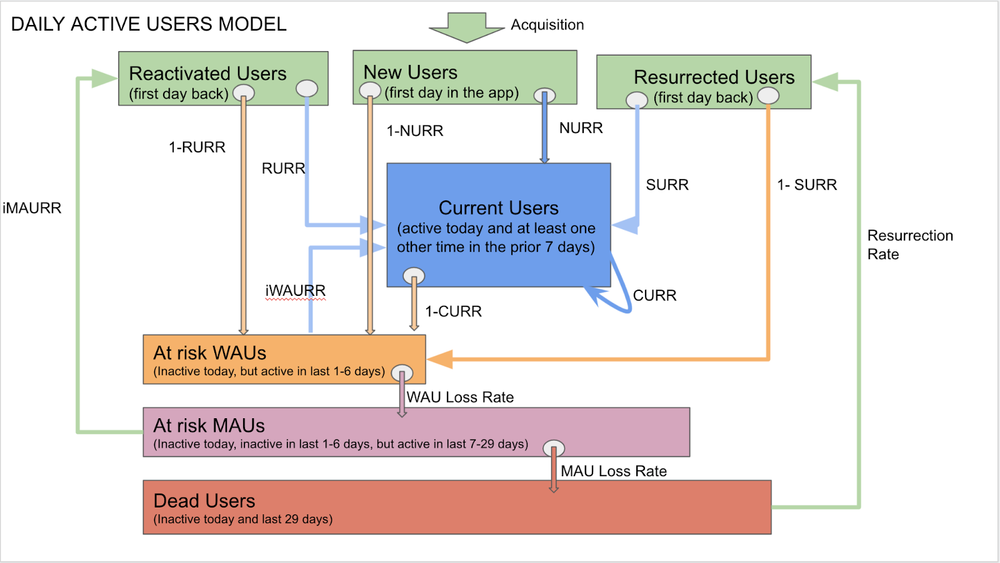

# 产品留存率

> It costs five times as much to attract a new customer than to keep an existing one.
> 获取一个新客户的成本是留住一个老客户的五倍。
> —— 商业格言

> Compound interest is like a snowball of sticky snow. The trick is to have a very long hill.
> 复利就像一个黏雪球。关键是找到一条足够长的坡。
> —— Warren Buffett

村上春树在《当我谈跑步时，我谈些什么》里写到：

> 开酒吧时我也遵循同样的原则。酒吧来了很多客人，如果十个人里有一个喜欢这里，说下次还会再来，那就够了。十个人里有一个成为回头客，生意就能维持下去。换句话说，另外九个人不喜欢我的酒吧，也无所谓。
>
> 想通这一点，肩上的担子一下轻了。不过，我必须确保那个喜欢这里的人是真的喜欢。为此，我必须让自己的理念和态度足够鲜明，并且无论如何都要耐心地坚持下去。这是我从经营中学到的。

这就是留存。

## 为什么留存是最重要的指标

Casey Winters 曾任 Pinterest 和 Grubhub 的增长负责人，他说：

> 好的留存是产品规模化增长的方式。它是产品市场匹配度的最佳指标，是用户生命周期价值的最重要因素，高留存驱动所有最佳的获客策略。

留存决定了蓄水池能有多大。

想象一个水池，有进水口和出水口。用户获取是进水，用户流失是出水。低留存意味着出水口大，新用户来了也留不住。

知识星球上有很多星主在运营付费社群，每个星球其实就是一个小产品。第一年大家都在拼命拉新，看不出差别。第二年、第三年，留存的差异开始显现。五年后，90% 的星球消失了，其中不乏当年风光一时的。能活下来的，都是把成员留住了的。

留存也决定了获客规模能做多大。

假设两款产品，收入模式一样，目标用户一样。甲的长期留存比乙高一个百分点，用户生命周期价值就可能高出十个百分点。

这意味着什么？甲可以出更高的价格买广告，乙跟不起。于是甲的获客能力是乙的两倍、三倍，甚至更多。最后甲成了市场王者，乙勉强活着，甚至被淘汰。

这种故事每天都在上演，哪个行业都一样。

所以，一个简单粗暴的建议：留存率上来之前，不要花大钱推广。

## 如何衡量留存

衡量留存之前，先要定义什么叫“活跃”。

很多团队用“打开 App”作为标准。这太宽泛了。用户打开了又关掉，什么都没做，算活跃吗？

更好的做法是找到产品的核心动作。知识星球的核心动作是“阅读帖子”；微信读书是“阅读时长超过 5 分钟”；外卖平台是“下单”。

定义活跃时，要结合产品的自然使用频率。外卖可能每天用，记账软件可能每周用，旅行预订可能每月用。用每日留存去衡量一个月用一次的产品，没有意义。

定义好“活跃”之后，下一个问题是：怎么把用户分类，才能找到提升留存的杠杆？

### 多邻国的用户分层模型

多邻国是一款语言学习 App，2019 年时增长遇到瓶颈。他们做了一件事：把所有用户分成七个桶，每个用户每天只能在一个桶里。

四个桶是今天活跃的用户，加起来就是日活：

- 新用户：今天第一次用
- 当前用户：今天用了，过去一周也用过
- 回流用户：消失了一到四周，今天回来了
- 复活用户：消失了一个月以上，今天回来了

三个桶是今天不活跃的用户：

- 有流失风险的周活用户：今天没来，但这周来过
- 有流失风险的月活用户：这周没来，但这个月来过
- 休眠用户：一个月以上没来

这个分类的好处是：每个桶之间有明确的流动关系。新用户如果明天还来，就变成当前用户；当前用户如果明天不来，就变成有流失风险的周活用户；一直不来，就慢慢滑向休眠。

多邻国给每个流动路径起了名字，比如“当前用户明天还来”的概率叫 CURR（Current User Retention Rate，当前用户留存率）。

然后他们做了一个模拟：如果把每个指标都提升 2%，哪个对日活的影响最大？

结果让他们吃惊：CURR 的影响是第二名的五倍。

为什么？因为当前用户有个特点：他今天来了，明天还来，后天还来，他就一直待在“当前用户”这个桶里。这是复利。

新用户不一样。新用户今天来，明天不管来不来，他都不再是新用户了。新用户留存率再高，也只影响他一次。但当前用户留存率高，影响的是他接下来的每一天。

想通这一点，多邻国做了个重大决定：不再把精力放在新用户激活上，专攻当前用户留存。

他们成立了专门的留存团队，北极星指标就是 CURR。四年后，CURR 提升了 21%，日活增长了 4.5 倍。

### 多邻国做了什么

CURR 是个结果。要提升它，得找到具体的手段。多邻国主要做了三件事：

第一，排行榜。用户不再只跟朋友比，而是跟参与度相近的陌生人比。还有联赛系统，每周升降级。这让学习变成了游戏。结果：用户学习时间增加了 17%。

第二，优化推送。他们的原则是“保护渠道”——宁可少发，也不能让用户关掉通知权限。每条推送都要有价值。他们不断测试发送时间、文案、模板，但从不增加数量。

第三，连续打卡。如果用户快要断掉连续学习的天数，发一条提醒：“你的 30 天连胜就要断了。”这招很管用。连胜天数越长，用户越舍不得断。多邻国还加了日历视图、动画效果、冻结机制，让打卡这件事变得更有仪式感。

四年后，连续打卡 7 天以上的用户，从不到四分之一，涨到了超过一半。

### 知识星球的实践：连胜功能

看到多邻国的成功，我们也想在知识星球做类似的事。下面是一个真实的内部提案和讨论过程。

这个提案不是一次就通过的。它的雏形在 v4.59 版本的需求牌桌首次提出，当时方案设计不够完善，缺少数据支撑，被否了。后来团队参考多邻国的成功案例，经过几个版本的调整，最终形成了下面这个方案，通过了牌桌。

---

**问题**

作为产品，我希望提升活跃用户的正反馈，以便于用户获得大量正反馈，能持续活跃。

目标：让 CURR 中的 B 类用户往 A 类迁移，稳住 A 类用户的流失率。

**方案评估**

| 干系人 | 影响值 | 信心度 | 容易度 | 总分 |
| --- | --- | --- | --- | --- |
| a 总、枭雄 | 8 | 5 | 3 | 16 |

**方案：登录/互动连胜**

工作量预估：

- 根据排行榜的设计
  - 按全体用户排行，13 个故事点，性能消耗很小
  - 按星友排行，13+5 个故事点，持续消耗性能
- 不要奖励系统，则 8 个点

功能设计包括：入口、连胜达成提醒、连胜日历、星友连胜榜、通知与召回。

**牌桌讨论**

a 总：先验证用户对连胜是否有感觉，先做入口、排行榜，看数据再做其他标识等地方的拓展。

枭雄：已调整方案。

**结论**

当作实验来推进，定好阶段性目标，推行一段时间后看是否达到目标，再判断接下来回退还是进一步优化。

**目标设定**

访问过连胜日历的用户里，后续 7 日活跃人天数较前 7 日涨幅 > 5%。

举例：

| 人数 | 统计周期（天） | 理想访问人天数 | 访问人天数（上线前） | 占比 | 访问人天数（上线后） | 占比 |
| --- | --- | --- | --- | --- | --- | --- |
| 100 | 7 | 700 | 100 | 14.29% | 105 | 15% |

注：以上是粗糙举例，实际数据在分析的过程中，会根据时间跨势和用户个体差异来精细计算。

---

这个提案有几个值得注意的地方。

第一，目标明确。不是"做一个连胜功能"，而是"让 B 类用户往 A 类迁移"。功能是手段，用户行为变化才是目的。

第二，先验证假设。a 总的反馈是"先做入口和排行榜，看数据再做其他"。不是一口气把所有功能做完，而是用最小成本验证核心假设：用户对连胜是否有感觉。

第三，设定可量化的成功标准。"7 日活跃人天数涨幅 > 5%"是一个具体的数字，上线后可以直接对比。达到了就继续优化，达不到就回退。

这就是"当作实验来推进"的意思。产品决策不是赌博，是假设验证。

### 知识星球的实践：CURR 指标

看到多邻国的案例后，知识星球也开始用类似的方式分析用户。

CURR 的原意是当前用户留存率，特指上周有活跃的用户群体在本周继续活跃的留存率。

但在知识星球的场景里，为了适应我们的需求，我们调整了计算方式：

- 我们在 Redash 看板上监测的数据以天为单位，图表上的每个时间点不是简单地反映当天的数据。
- 图形上的每个时间点，均以该类用户前 7 日的活跃天数为主体量级，去计算他们中有多少是前一周活跃的，来作为我们 CURR 的计算指标。

我们把用户分成两类：7日3活（过去七天至少活跃三天）和7日1-2活（过去七天只活跃一到两天）。

7日3活用户量级基本稳定的情况下，约 93% 的用户都是过去两周都保持了一定的活跃频率，有一定的活跃黏性。剩下的 7% 在上周没有活跃，来源可能是新增用户，或者之前的沉默回流用户，但占比很小。

7日1-2活用户中，仅有约一半是上周有活跃过的，另一半可能是新增用户、沉默回流等用户。这说明这部分用户实际上没有形成很好的活跃黏性，随时可能摇摆或者流失。

为什么不直接用多邻国的计算方式（上周活跃的用户中，本周活跃的比率是多少）？

我们选择当前计算方法，基于两方面考虑：

- 它结合了我们的天粒度统计方式，能更全面地反映 App 整体活跃状况，也能更及时地更新日变化数据。
- 当前方法可以更精确地识别7日3活指标中有多少用户来自上周活跃群体。当出现热点效应或拉新活动等事件性波动时，CURR 指标能够立即捕捉并展现更合理的弹性变化（一般是下降），为业务决策和实时监控提供更准确的指导信息。

## 如何提升留存

提升留存没有银弹，但有几个方向值得尝试。

### 改善新用户激活体验

新用户的第一次体验决定了他们会不会留下来。找到产品的“aha moment”，让用户尽快体验到核心价值。

Duolingo 让用户在注册前就能开始学习。完成第一课、感受到乐趣后，再让他们注册。这时候用户已经投入了时间，留存自然更高。

### 改善核心产品体验

留存本质上是产品价值的体现。产品不够好，任何增长技巧都是徒劳。

Spotify 早期发现，用户如果在第一周内收藏了至少一首歌，留存率会大幅提升。于是他们把“收藏歌曲”放在最显眼的位置，不断引导用户去点。

知识星球也有类似的发现：星主更新频率高、跟成员互动多的星球，续费率远高于其他星球。成员每次打开星球，都能看到新内容，都能感受到星主在用心经营。这种体验积累起来，到了续费的时候，他自然愿意继续留下来。反过来，如果星主三天打鱼两天晒网，成员打开几次发现没什么新东西，慢慢就不来了。一年后让他续费，他早就忘了这个星球。

这个发现直接指导了产品迭代。我们开始在各种地方提醒星主：该更新了，该回复成员了，该发起一次讨论了。本质上，就是在帮星主提升他们的“CURR”。

先问自己：用户为什么要回来？回来能得到什么？答不上来，问题在产品本身。

### 添加参与循环

用户不会自己记得回来。你需要制造理由，让他们形成习惯。

推送通知是最常见的方式，但要克制。好的推送是帮用户想起他关心的事，而不是骚扰。

LinkedIn 的“谁看过你的主页”是个经典设计。你收到通知，好奇是谁在关注你，点进去看。看完之后，顺手逛逛别人的主页。然后那个人又收到通知说你看过他——循环就这样转起来了。

### 添加用户投资

用户在产品里投入越多，离开的成本就越高。

Pinterest 让用户创建“画板”，收藏喜欢的图片。用了一段时间后，用户积累了几十个画板、上千张图片。这时候让他换一个产品？太难了，那些心血都在这里。

投入可以是时间、关系、数据，也可以是金钱。

### 创造复购或续费理由

对于交易型产品，需要让用户有理由再次购买。

Amazon Prime 是个典型例子。用户付了会员费，就会想“既然都付了钱，不用白不用”。于是更频繁地在 Amazon 购物。付费反而提升了留存。

会员体系、积分、优惠券都是常见手段。但更根本的是：用户买完之后，是否满意？满意才会复购。

### 唤醒沉睡用户

不是所有用户都会自然回来。需要主动唤醒沉睡用户。

Dropbox 发现很多用户注册后就不再回来。他们发一封邮件：“你的文件还在这里等你。”简单，但有效——提醒用户他们存过东西，那些东西还有价值。

关键是找到用户离开的原因，然后给他一个回来的理由。“你有一张优惠券即将过期”比“好久不见，回来看看”更有效。

### 复活流失用户

用户流失了，不代表永远失去。

Strava 是运动记录应用。很多用户冬天不跑步，就流失了。春天来了，Strava 发一封邮件：“天气变暖了，你的跑鞋准备好了吗？”配合季节和用户习惯，把人拉回来。

定期分析流失用户，找到他们离开的原因。产品有重大更新时，可以尝试重新触达。但要尊重用户选择——如果他们明确表示不想收到消息，就别再打扰了。

## 稳定期：不跌就是站住了

上面说的都是“怎么提升”。但有时候，不跌就是胜利。

有一年，我拿知识星球的数据去请教 Tony。数据比较平稳，没有大幅增长，我有点着急，还提了一些突破的设想。

Tony 的第一反应是：挺好的啊，没有急剧下跌，说明这一关站住了。

那一年，知识星球经历了全部星球都跨越“付费期限”，到了需要用户续费的时刻；经历了“知识付费”从热浪滚滚到趋于冷静；还有一些不足为外人道但对增长影响很大的事。

还好数据没跌。

拿着那些突破的设想找 Fenng 请教，他说：“变化有点大，如果是我，可能会先选择优化。”找 Shotgun 请教，他说：“这一年来，做了很多功能，可以说没有一个成功的。”

我开始对“新功能”和“边界拓展”心怀恐惧。

纯银写过一段话，说的是同样的道理：

> 当产品处于上升期时，还看不到天花板，团队的心态冷静，每一步都走得比较稳。但是当产品上升乏力，碰触到天花板时，人之常情——大家着急了，总想着“出奇制胜”，找到一个产品发力点来撬开局面。在这种心态下，特别容易搞大跃进。
>
> 人一急，就容易出错。这是自然规律。

他还写过关于产品边界：

> 每一款产品是有边界的。边界很大，但被团队活生生做砸了的产品案例很少很少，比如人人，比如开心。然而边界不大，团队急了，通过“加功能”和“大改版”强行拉伸边界的产品案例很多很多，拔苗助长，几乎每一款产品都遇到过。

所以，稳定期的策略是：不要急。数据没跌，说明站住了。与其急着找突破口，不如先把现有的东西优化好。

## 留存是结果，不是目标

留存是一个滞后指标。它反映的是用户过去的行为，而不是当下的状态。

当你发现留存下降时，问题早就发生了。你只是现在才看到结果。

所以，与其盯着留存数字，不如关注那些能影响留存的先行指标：新用户激活率、核心功能使用率、用户满意度。把这些做好，留存自然会跟上来。

回到开头村上春树说的：十个人里有一个成为回头客，生意就能维持下去。

但他还说了另一句：必须确保那个喜欢这里的人是真的喜欢。为此，要让自己的理念和态度足够鲜明，并且无论如何都要耐心地坚持下去。

留存的本质，不是技巧，是价值。

参考链接：

- https://www.lennysnewsletter.com/p/what-is-good-retention-issue-29
- https://caseyaccidental.com/what-is-good-retention
- https://www.lennysnewsletter.com/p/how-to-increase-your-products-retention
- https://www.lennysnewsletter.com/p/how-to-measure-cohort-retention
