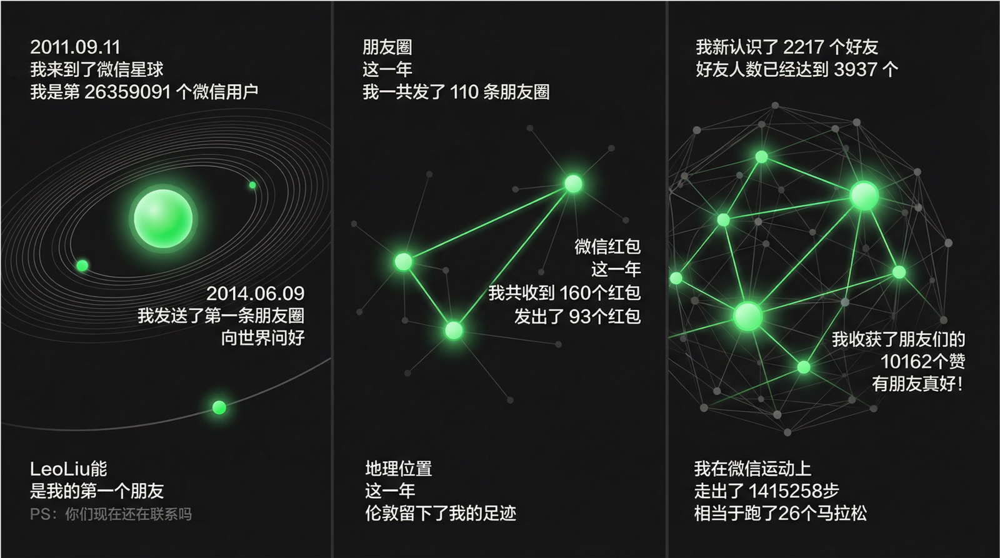
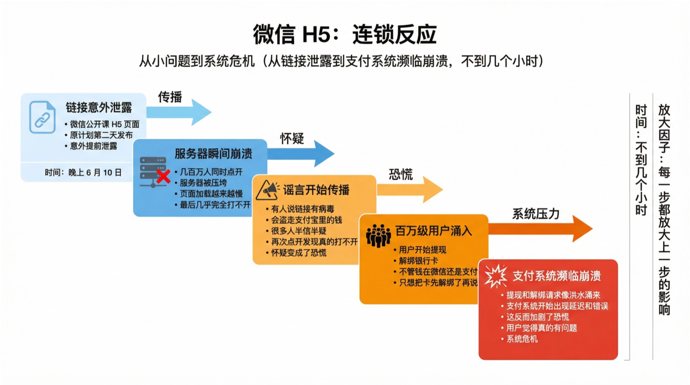
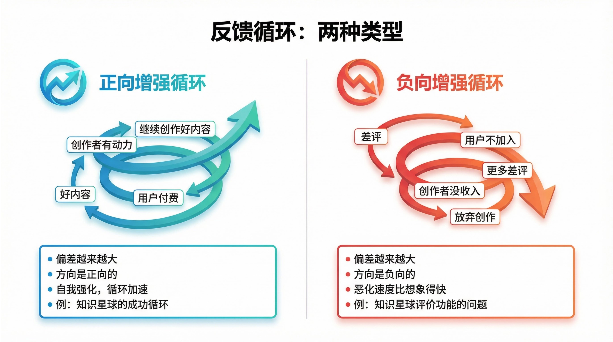
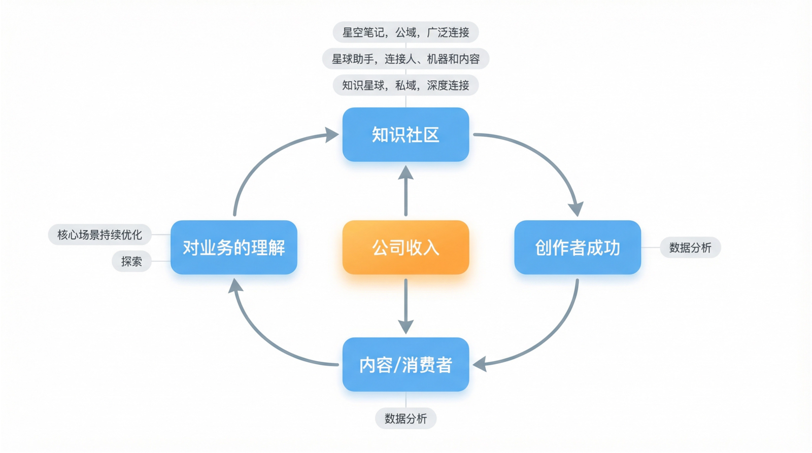
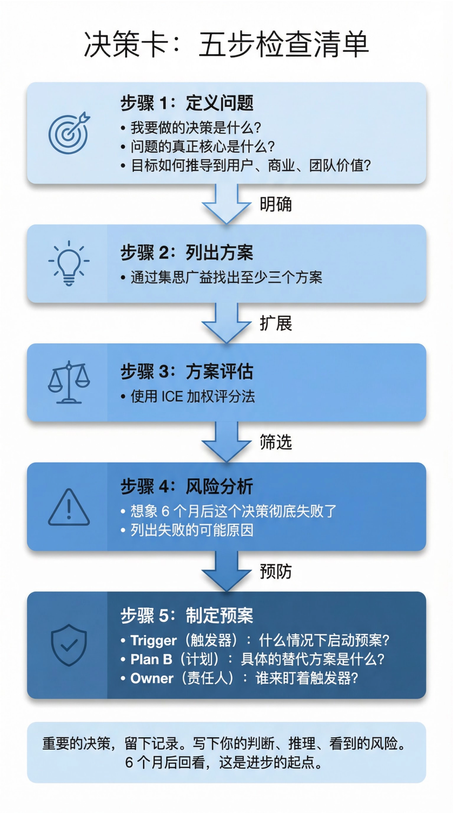

为什么一个正确的决策，反而把事情搞砸了？

---

# 系统思维

> 风起于青萍之末。
>
> —— 庄子

> 如果你是个诗人，你会清楚看到在这一张纸上飘着一朵云。没有云，就没有雨，没有雨，树无法成长，没有树，我们无法造纸。如果看得更深入，可以看到太阳、砍树的工人、他的爸爸、妈妈、面包的麦子。没有这一切，这一张纸无法存在。事实上，我们没办法指出任何一件不在这里的东西──时间、空间、地球、雨水、土中的矿物质、阳光、云、河、温度、人的心。一切在这一张纸中同时并存。所以可以说纸和云“互为彼此”。我们不能单独存在，必须和万物“互为彼此”。
>
> —— 一行法师（Thich Nhat Hanh）

## 微信里的连锁反应

2016 年 6 月 10 日晚上，一个链接开始在朋友圈疯传。

这是微信公开课准备的 H5 页面（重绘版本）。你可以看到自己的第一个微信好友是谁，发过多少红包，收到过多少红包。这些数字像勋章一样，让人忍不住想晒到朋友圈（图 3-1）。

图 3-1 微信 2016 公开课 Pro 版 H5 页面（重绘示意图）

但这个链接原本计划在第二天的活动现场才发布。它意外泄露了。

链接的传播速度超出所有人想象。几百万人同时点开它。服务器瞬间被压垮，页面加载越来越慢，最后几乎完全打不开。

这时候，谣言出现了。有人开始在朋友圈里说：这个链接有病毒，会盗走你支付宝里的钱。

很多人半信半疑。但当他们再次点开链接，发现真的打不开时，怀疑变成了恐慌。

接下来的场景让微信支付团队措手不及。百万级的用户涌入微信，开始提现、解绑银行卡。他们不管钱在微信还是支付宝，只想把卡先解绑了再说。

提现请求和解绑请求像洪水一样涌来。微信的支付系统也扛不住了，开始出现延迟和错误。这反而加剧了恐慌：你看，真的有问题。

从链接泄露到支付系统濒临崩溃，不到几个小时。

微信和支付宝都紧急发布公告辟谣。张小龙后来在微信公开课上专门讲了这件事。他说：“有一点小小的疏漏可能就会在这个平台里面被放大很多很多次。”（图 3-2）

图 3-2 微信 H5 事件的连锁反应

张小龙后来把这件事称为一次蝴蝶效应：一个小疏漏引发连锁反应，每一步都放大上一步的影响，最终演变成灾难。而且，你原本设计的传播力越强，失控时的破坏力就越大。

但有时候，触发连锁反应的不是意外，而是一个看起来完全正确的决策。我自己就经历过。

## 知识星球的评价功能

几年前，我们在知识星球里做了一个评价功能。想法很简单：

- 让付费用户评价一下星球的质量，帮新用户做决策。
- 电商的评价已经非常成熟，我们学习、简化就行。

设计不复杂：用户付费加入 7 天后，系统会提示他评价，只有两个选项：满意，或者后悔。新用户在付费前可以看到评价数据，比如 1000 人评价，950 人满意，50 人后悔。

上线后很快收到反馈。有星主说“后悔”这个词太重了，像一把刀。我们马上改成“期待改进”。

但问题没有解决。数据开始说话。部分星球出现了断崖式下跌。这些星球的差评率超过 20%，新用户加入量直接腰斩。

我们复盘时才发现一个被忽略的系统性问题：同样是 10% 的差评率，对 50 人的小星球和 5000 人的大星球，杀伤力完全不同。

用户看到“5 人期待改进”，可能觉得还行。但看到“500 人期待改进”，即便比例一样，心理感觉完全不同——这么多人不满意。

更糟的是：小星球样本量小，几个差评就足以让转化率归零。大星球因为基数大，评价更稳定，更容易获得信任。我们原本想帮小星球建立信任，结果却在系统里制造了一个对小星球极其不公平的机制。

功能下线后，甚至有星主专门感谢，说下线之后，他的星球购买量增加了。

数据显示：虽然总体差评率只有 10%，但确实有更大数量的星球因为这个功能，收入下降了。

这次经历的教训很具体：在一个参差不齐的生态里，一刀切的规则会产生不对称的伤害。电商评价对标准化商品有效，但知识星球里每个社群的体量、阶段、内容类型都不一样，同一套规则对大星球是加分项，对小星球是致命伤。

## 系统思考

你改变的从来不只是一件事。

微信 H5 和知识星球评价功能，表面上看是两个完全不同的问题。一个是技术故障引发恐慌，一个是产品设计伤害用户。但它们背后有一个共同的模式：你动了一个地方，整个系统开始连锁反应，最终结果远超预期。

系统思考就是理解这些连接，在决策之前预判连锁反应。它有三个核心概念。

第一个：连接

事物之间有关系。你改变 A，会影响 B，B 又会影响 C。

微信 H5 案例里：服务器崩溃 → 用户怀疑 → 谣言传播 → 恐慌性解绑 → 支付系统崩溃。每一步都是上一步的结果，也是下一步的原因。

创业里到处都是这样的连接。你降价，用户增加了，但客服压力也增加了，服务质量下降，差评增多，最后反而流失用户。

第二个：反馈循环

A 影响 B，B 又反过来影响 A。这种循环有两种：

增强循环：偏差越来越大，正向或负向都会自我加速。口碑好，用户推荐更多用户。口碑差，一个差评处理不当，会引来更多差评。后面知识星球的案例会详细展开这种循环。

调节循环：系统的自动刹车。用户太多，创作者回复不过来，体验下降，用户流失，系统自动回到平衡点（图 3-3）。

图 3-3 两种反馈循环

家庭里也有这种循环。你批评孩子的方式不对，孩子觉得被攻击，开始抵抗。你更生气，批评更重。孩子更抵抗，关系越来越僵。这是负向增强循环。

非暴力沟通能打破这个循环。换一种方式——先说事实，再说感受，最后说你需要什么——孩子觉得被理解了，愿意听你说。沟通顺畅了，关系变好，下次沟通更容易。同样的循环结构，换了一个起点，方向就反过来了。

知识星球评价功能的问题也出在这里。我们以为加了评价功能，会形成“透明 → 信任 → 购买增加”的增强循环。结果对小星球来说，它变成了“差评 → 转化率归零 → 没有新用户 → 星主放弃”的负向螺旋。

第三个：时间滞延

今天的决策，要几个月后才能看到真实后果。

评价功能上线时，总体数据没问题。我们以为成功了。但几周后，小星球的数据开始断崖式下跌。伤害不是立刻发生的，而是慢慢累积，等你注意到的时候，已经造成了损失。

时间滞延让人容易误判因果。一个决策上线后短期数据正常，并不代表它是对的——你只是还没看到后果。

理解了连接、反馈循环和时间滞延之后，还有一个概念值得讲：杠杆点。

豪尔赫·马扎尔（Jorge Mazal）在 Lenny's Newsletter 上介绍过多邻国（Duolingo）的做法。2018 年，Duolingo 遇到增长瓶颈。他们做了一个敏感性分析：把影响日活的所有指标排列出来，逐一测算每个指标变动 1% 时日活会变化多少。结果发现“当前用户留存率”对日活的影响是其他指标的五倍。他们把资源全部押在这一个点上，四年后日活增长了 4.5 倍。

杠杆点就是系统里那个撬动效率最高的环节。找对了，事半功倍；找错了，做再多也没用。

## 知识星球的系统循环图

这是知识星球的增强环（图 3-4）。

图 3-4 知识星球的系统循环

产品好用 → 创作者愿意投入 → 产出好内容 → 用户付费加入 → 创作者有收入、更有动力 → 继续创作。四个环节首尾相连，互相推动。

这个循环能转起来，有几个前提。

产品得够简单。知识星球就是个社区工具，让创作者通过内容深度连接铁杆粉丝。产品太复杂，创作者学不会，循环在第一步就断了。不仅通过付费连接，我们还提供工具让人们互动、交流、建立感情——这些年看到不少好事在星球发生，我知道的，就有三对情侣在星球里相识相爱并步入婚姻。

创作者得能看到回报。不一定是钱，也可以是影响力、反馈、归属感。知识星球有个特点：创作者成功，我们才有机会成功。这决定了我们和创作者站在一起。产品越好，用户在里面越有所得，创作者就越容易成功——收入更高、社群更活跃、交到好朋友、学到更多本领。为此我们基本全员客服，运营团队的工作重心都围绕协助创作者成功。

数据得能反哺。创作者越成功，用户增量越多，积累的内容也越多。我们通过数据分析，搞清楚什么类型的社群受欢迎、怎么定价合适、什么输出频率恰当，然后把这些信息反哺给创作者。

产品越好，创作者越容易成功，用户与内容越多，我们对社群的理解越深，产品就越好。但反过来也成立。这几个条件任何一个断了，循环就反转。评价功能就是在“用户信任”这个环节出了问题：差评让新用户不敢加入，创作者没有新增收入，逐渐失去动力。一个想“提升透明度”的功能，把增强环切断了。

画出你产品的系统循环图，找到哪些环节是前提条件，守住它们。同时警惕：任何新功能、新策略都可能在某个环节插一刀。

## 决策的方法

理解系统思考之后，怎么做决策？

飞行员知道怎么开飞机，但起飞前仍然要逐项核对检查清单——清单能确保在压力下不遗漏关键步骤。做决策也一样，我用一张决策卡来约束自己的思考过程。

决策卡的第一步是问三个系统思考的问题：这个决策会影响哪些人或事？这些影响会产生什么反馈，是增强还是削弱？6 个月后、1 年后，系统会变成什么样？

但光问这三个问题还不够。你需要：

1. 定义问题。你要做什么决策？问题的核心是什么？目标怎么推导到用户价值、商业价值、团队价值？这一步最容易被跳过。你可以试试：挑一个正在执行的项目，分别问几个同事“这个项目要解决什么问题”，答案的分歧程度会让你吃惊。

2. 列出方案。找出至少三个方案。去行业里找，去学术界找，集思广益。大部分人只会拿出脑子里蹦出的第一个方案。但一定有更多选项，什么都不做也是一种方案。方案多了，你就不会被逼到只能在差和更差之间选。

3. 评估方案。先定标准，给每个判断项分配权重，然后打分。ICE（Impact 影响力、Confidence 信心度、Ease 实施难度）是一种常用的加权评分法。像砍需求一样砍方案，优选方案也有调整空间。

4. 风险分析。有个方法叫 Pre-mortem，“事前验尸”：假设 6 个月后这个决策彻底失败了，让团队列出所有失败原因。这能从不同视角覆盖风险盲区。

5. 预案。好的预案有三个要素：触发条件（Trigger）、应对计划（Plan）、责任人（Owner）。责任人盯着触发条件，一旦触发，带着 Plan B 救场。

重要的决策，留下记录。写下判断、推理、看到的风险。6 个月后回看，有些对，有些错，但你能看到自己当时是怎么想的（图 3-5）。

图 3-5 决策卡：五步检查清单

就算很小的决策，也会在系统里引发连锁反应。系统思考让你看清这些连接，决策卡让你不遗漏关键步骤。