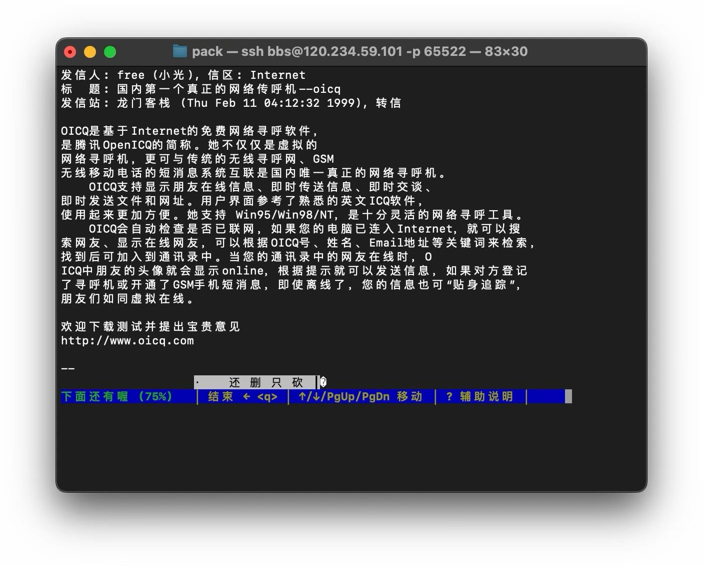

现在开始合适吗？

---

# 时机

> Luck is what happens when preparation meets opportunity.
> 运气，就是准备遇到了机会。
>
> —— Seneca

有一年春节，一个英语老师给我发了个红包，写着“新年快乐，谢谢你”。我不认识她，微信上加了几千位知识星球用户，没敢领。

我回：“不用客气，新年快乐。”

她打了长长一段话：“我教英语。以前想开培训班，一想到场地、招生、竞争就头疼。看到知识星球，建了圈子，在里面讲题、教写作文、解答任何英语相关的问题，我自己的学生免费加入，他们觉得好，就推荐给朋友，现在有点人气了。”

我回：“真棒，加油，祝越做越好。有任何问题，随时找我。”还是没领红包。

她过了一会儿发来：“收了红包呗，一点心意，谢谢你们。两个多月，一万多，够给女儿买钢琴，我们都很高兴。”

我领了红包。我也很高兴，甚至比看到大咖在知识星球里收入几十万更高兴。

为什么？

那些大咖本来就有流量，有粉丝，有影响力。他们在哪儿都能挣到钱。知识星球只是多给了他们一个选择。

但这个英语老师不一样。她没有光环，没有资源，只有一点教学经验和几个学生。开培训班要场地、招生、竞争，成本高，风险大。她在传统商业逻辑里很难做成什么。

但她用知识星球，找到了自己的活法。两个多月，一万多块，够给女儿买钢琴。

她不在风口上。没人会投资一个英语老师的小社群，没有媒体会报道她。但她在夹缝里活得很好。

这才是知识星球想做的。不是只服务头部，而是让更多普通人有机会。他们在夹缝里生长，我们也在夹缝里生长。

她的时机是什么？回头看，2016 年，移动支付成熟了，知识付费心理门槛打破了，知识星球产品准备好了，她的教学经验也积累够了。这些条件对齐，时机就到了。

什么是时机？

不是运气，是外部环境与内部准备的交汇点。技术成熟了，用户习惯改变了，市场窗口打开了，而你刚好准备好了。

同样的想法，不同的时间，结果天差地别。早了，用户还没准备好。晚了，窗口已经关闭。

但小团队看时机，跟大公司不太一样。大公司追风口，追市场爆发。小团队不用，你只需要找到那个你准备好的时刻。

## 风口与时机

创业圈有个共识：时机决定成败。Bill Gross 对 200 家创业公司做了系统分析，时机占成功失败差异的 42%，排第一。

为什么时机这么关键？Z.com 在 1999 年推出在线视频平台，但宽带普及率太低，失败了。两年后宽带突破 50%，YouTube 用相似模式成功了。同样的想法，差两年就是生死之别。

时机确实重要。

但大公司和小团队看的时机不一样。

大公司看的是外部时机：市场窗口打开了吗，用户规模够大吗，能不能爆发性增长。他们需要追风口。Airbnb 和 Uber 都赶上了经济衰退期，人们急需额外收入，市场窗口打开了，时机成就了它们。

小团队看的是内部时机：我准备好了吗，我对这个问题理解够深吗，我能做出不一样的东西吗。

为什么看的不一样？

大公司需要巨大的市场。他们融了很多钱，投资人要回报，团队要增长。没有千万级用户，养不起这个公司。所以必须等风口，等市场爆发。

小团队不需要。几千个付费用户，一年几十万收入，就能活得很好。这个规模，不需要等市场爆发，只需要找到那一小群真正需要你的人。

所以小团队可以在不是时候的时候做事。这就是黑客思维的应用：大公司追风口、等市场爆发的“规则”，反而成了小团队的机会。

怎么判断内部时机到了？实话实说，我觉得很难判断。回头看，时机对的项目，条件确实对齐了：问题真实，解法独特，技术可行，用户有需求。但这是回顾视角。站在当时，没人能把这些条件看清楚。

大公司需要判断时机，因为一颗子弹打出去，代价几千万。判断错了，整个团队白忙一年，投资人要交代。所以他们花大量时间做市场调研、竞品分析、趋势预测，试图在出手前确认时机到了。

小团队不一样。几个人，几个月，做出来试试。试错成本低，这本身就是你最大的优势。与其花大量精力判断“时机到了没”，不如问一个更简单的问题：我试得起吗？

试得起，就试。试了才知道时机对不对。

## 知识星球的时机

2016 年之前，公司做团队协作工具，不温不火。2014-2015 年连续做了四款产品，都没站住脚。钱在烧，团队士气低落。

转机来自跟Fenng的聊天。他运营“小道通讯”付费邮件列表，管理很痛苦：手工做表格增删用户，邮件列表各种坑。

我们想到可以调整小密圈的方向，作为连接大 V 和订阅者的工具。

为什么这个时机对：移动支付准备好了，知识焦虑起来了，内容创作者需要变现工具。

更关键的是，我们之前做“手机论坛”解决微信群问题的积累没白费。那套内容组织方式，刚好可以用在连接创作者和铁杆粉丝上。加上付费功能，就齐了。

2016 年 11 月，Tony 看了我们的数据说：“总算走出了第一步，可以看到小密圈的星星之火。”用户因为信任创作者，愿意给产品更多耐心。创作者帮我们传播，比我们自己说一百遍都管用。

回头看，条件确实对齐了。知识焦虑真实存在，知乎 Live、分答、得到火了，用户习惯了为知识付费。移动支付成熟了，微信红包让大家觉得 200 元以下都是零钱。我们之前做手机论坛积累的内容组织方式，刚好能用在付费社群上。

但这是回头看。站在当时，我们看到的只有碎片。跟 Fenng 聊天时，并没有想清楚“付费社群”的完整图景。他说管理邮件列表很痛苦，我们觉得可以试试，就开始做了。做着做着，才发现支付宝的付费群在创作者中很火，但“群”的老问题都在：内容无法沉淀，信噪比低，主题跑偏。我们之前做手机论坛正是为了解决这些问题——但当时做手机论坛的时候，没人知道这套东西将来能用在付费社群上。

洞察是边做边摸出来的。实现能力是事后才发现刚好能用的。时机不是判断出来的，是试出来的。

但时机对了，不等于能做成。

2017 年初，我们做了 SWOT 分析，觉得紧迫感很强。面临的风险有：

- 内容管控风险。来自上级监管的管理，企业如果风控没做好，一个不小心就死了。
- 竞争风险。微博、知乎、分答都在做，还有很多创业公司。
- 用户留存风险。一年后，用户还会续费吗？
- 技术风险。服务稳定性能保证吗？

每一项都可能让我们死掉。

时机对了，只是有了入场券。能不能活下来，还得看后面怎么做。

## QQ 的外部时机与内部准备

1998 年，即时通讯是个明显的外部时机。但同样的时机下，有人成功，有人失败。

那年广州电信拿出 90 多万招标，要做即时通讯系统。飞华中标，推出了 PCICQ。开发者极有才华，一个人用 Delphi 完成了服务端和客户端。

腾讯的几个人也在做类似的东西，叫 OICQ。1998 年 11 月中旬，从白板上手画的 3 条协议（登录、收发消息、登出）开始，11 周后，1999 年 2 月 10 日，距离春节不到一周时推出了第一版。

图 5-1 Free（小光）在 BBS 发布 OICQ 的帖子（1999 年 2 月 11 日）

同样的外部时机，为什么 PCICQ 失败了，QQ 成功了？

外部时机一样：互联网开始普及，人们需要在线聊天，即时通讯是刚需。PCICQ 和 QQ 面对的是同一个市场。区别在于谁在试，怎么试。

PCICQ 是招标项目。做完交付，拿钱走人。交付就是终点，没有迭代的空间。

QQ 是创业项目。Pony 负责产品，Tony 负责架构，Free 写前端，Kenny 写后端，11 周推出第一版。客户端用 C++ 静态编译，只有 200 多 K，小巧又快。他们做了一个关键决定：把好友列表存在云端。国外的即时通讯产品把好友列表存在客户端，因为大多数人有自己的电脑。但中国不一样，很多人在网吧上网，换台电脑就找不到朋友了。这个洞察技术难度不大，关键是他们在用户中间，看到了这个问题。

更关键的是，QQ 发布后保持一周迭代 5-6 次。用户在聊天室捣乱，马上做个小黑屋功能上线。PCICQ 每次掉线，QQ 就迎来一波新用户。

同样的外部时机，一个交付了就停了，一个一直在试、一直在迭代。时机对谁更好，是试出来的，不是判断出来的。

## 试得起，就是好时机

有人会问：不判断时机，不是蛮干吗？

不是。蛮干是不顾成本地投入。小团队的优势恰恰是成本低。几个人，几个月，做出来看看市场反应。这不是蛮干，是用最小代价获取真实信息。

大公司判断时机靠分析，小团队判断时机靠行动。大公司需要在出手前确认，因为打出去的不是子弹，是导弹，代价太大。小团队可以先开一枪，听听响，再调整方向。

回到英语老师的故事。她没有分析移动支付趋势，没有研究知识付费心理门槛。她看到了工具，试了，成了。回头看条件确实都对齐了——但她当时不知道，也不需要知道。

大公司要等风口，等市场爆发，等千万级用户。小团队不用。你只需要几千个付费用户，一年几十万收入，就能活得很好。

这意味着你可以在“不是时候”的时候做事。你可以做小众市场，做鸡肋方向，做大公司不屑做的事。

小团队最大的自由，就是不用等。试得起，就是好时机。
