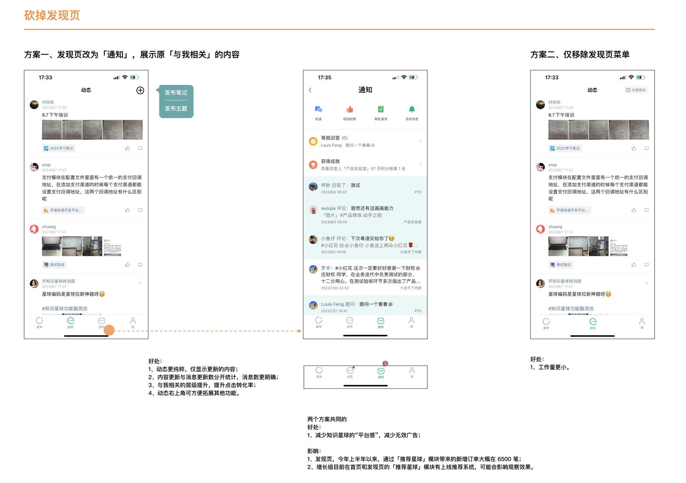

小公司需要价值观吗？

---

# 价值观与规则

> Core values are only core values if you're willing to be punished for holding them.
> 核心价值观只有在你愿意为坚守它而付出代价时，才是真正的核心价值观。
>
> —— Patrick Lencioni

> It's not hard to make decisions when you know what your values are.
> 当你清楚自己的价值观，做决策就不难了。
>
> —— Roy Disney

## 二十年，我们做对了什么

公司创办于 2005 年，二十多年了。

开始创业时我在深圳，冰河在北京，各自打工，在公司里都有不少觉得不合理、希望改的事。在一次电话讨论中聊起，索性再努力三个月，如果实在无力推动，就出来自己干，试试能不能做一家自己喜欢的公司。结果，一个月后，冰河把家当打包了大大小小一堆箱子，物流发到我家，两口子就来了深圳。我只好辞职，开始了我们鲁莽的创业。

我们一直是家很小的公司，公司里来来去去了不少同事，现在也只有五十人。这或许是一种真实的创业状态——上市、做出伟大的产品、被全世界看见和关注……这样的梦很多人有，很少人能达成，全力以赴就好。

有点小小的骄傲的是，二十多年都准时发放了同事们的工资，年终奖也都在过年前发，让同事们过年的时候口袋里殷实一点。

尝试过很多事，绝大多数失败了。二十多年我们做过的产品，有好几十个，现在还在持续迭代并且创造价值的并不多。但很棒的是，我们一直在尝试。

我们做对了什么，让公司活了二十多年？答案至少有：

- 我们一直尽量简单、认真、诚恳、诚实。无论对客户、同事、合作伙伴还是对自己，都这样，最终可以收获信任。
- 我们足够坚韧，一直在迭代。
- 我们运气很好。

出发的时候，我们想要的公司，应该简单、透明、创造新东西、全力以赴做到最好。

有一次我问同事们：你觉得公司有什么是珍贵的、希望保留的？收到了几十份回复，高频词是：自由、平等、信任、人性化、温馨、简单。

这些词不是我们写在墙上的，是同事们自己感受到的。

## 知识星球的价值观

价值观如果只停留在墙上，没有被团队感知到，就等于不存在。

真正的价值观意味着愿意付出代价。如果“客户第一”不意味着“愿意退掉一笔高利润但对客户无益的订单”，那它就不是价值观，只是口号。如果一条价值观从来没让你做过艰难的选择、从来没让你放弃过到手的利益，那它只是装饰品。

我们的四条价值观首字母组成 HACK，好记：

### H - Hacker Spirit 黑客精神

- 对技术与创新充满激情。对新事物有好奇心，爱折腾，愿意投入自己的时间尝试、实验。
- 创造性解决问题，找到盲点和夹缝。我们的产品和业务，怎么做才会“不一样”？
- 突破限制，追求卓越。资源总是有限，怎样用有限的资源做到更多、更好？
- 开放、共享。

这四条说起来容易，做起来是什么样？DeepSeek 是一个非常贴切的例子。

2024 年，美国对中国实施芯片禁令，最先进的 AI 芯片不能出口到中国。硅谷的共识是：没有顶级芯片，中国的 AI 发展会被卡住脖子。

杭州有一家叫 DeepSeek 的公司，创始人梁文锋在接受采访时说了一句话：“钱从来不是我们的问题。芯片禁令才是问题。”

怎么办？他们选择了一条不同的路：用更聪明的算法，弥补硬件的不足。

2025 年 1 月，DeepSeek 发布了 R1 模型。这个模型在多项测试中达到甚至超过 OpenAI 的 ChatGPT o1。训练成本？560 万美元。而 OpenAI 训练 GPT-4 花了超过 1 亿美元。

硅谷震动了。风险投资人 Marc Andreessen 在社交媒体上写道：“DeepSeek R1 是我见过的最惊人的突破之一——作为开源项目，这是给世界的一份厚礼。”

这个突破是怎么来的？

梁文锋说，MLA 架构的创新来自一个年轻研究员的个人好奇心。“他分析了注意力架构的演变，突然有了一个新想法。但把想法变成现实是个漫长的过程。我们组建了团队，花了几个月，最终让它跑通了。”

DeepSeek 的团队几乎全是国内培养的人才，没有海归。梁文锋说：“如果追求短期目标，应该找有经验的人。但长远来看，经验没那么重要，基础能力、创造力和热情更关键。”

他们的组织方式也很特别——完全自下而上。梁文锋很少自上而下分配任务。他说：“面对颠覆性技术，闭源系统形成的护城河是短暂的。我们的护城河是什么？是同事们在这个过程中成长起来，积累了大量 know-how，形成了一个有创新能力的组织和文化。”

最后他说了一句话：“过去三十年，我们只强调赚钱，忽视了创新。创新不完全由商业驱动，还需要好奇心和创造欲。”

模型完全开源。任何人都可以下载、使用、修改。

好奇心、创造力、突破限制、开放共享——这就是黑客精神。有这样的精神，是我们的追求。

### A - Accountability 负责

- 给承诺，担责任，出结果。自己负责的事情，是不是有结果？
- 愿意“多走一步”。部门与部门之间的缝隙里，总会有些模糊地带，虽然不在我的 OKR 和职责范围里，还是应该尝试、推动、解决它。

2003 年，我在绿盟科技工作。那年冲击波蠕虫爆发。

平时晚上九十点钟公司就没人了，那天却很有意思。没什么人指挥，大家各自分工：研究部几个人分析蠕虫特征，TK 写了一个全自动清除蠕虫并修复漏洞的脚本，小海把它改写成图形界面的专杀工具，工程部干不了细致活儿，好歹把发给用户的公告、邮件内容备好了。

凌晨三四点，蠕虫分析清楚，专杀写好测试完毕，大伙才陆续散去。

那天的感觉是：感兴趣，自组织，就可以挺漂亮地完成一件事。不需要老板掺和指令。没有人考虑“这是不是我的工作”。

我对这件事印象非常深。这是我第一次见到这种主动向前一步的企业氛围。我很喜欢，真的很喜欢。

后来知识星球把“负责”写进价值观，“多走一步”是其中很重要的一条。它的意思是：看到问题，不要先想“这是谁的职责”，先想“我能不能帮上忙”。

### C - Customer First 客户第一

- 深入观察了解客户需求和潜在需求，超越客户期望，建立长期信任。
- 公司利益和客户利益冲突时，帮助客户。

有一次，一位用户申请退款。他 6 月 10 日 14:22 加入星球，6 月 13 日 14:39 退出。超过 72 小时退款期限，只差 17 分钟。

按规则不退，合法合规没毛病。但我想：换位思考，只差 17 分钟，用户未必能掐准时间。如果是我们自己遇到这种情况，内心能完全平静地接受吗？

最后决定：让星主得到收入，让用户没有损失，公司承担这笔成本。

段永平讲过一个故事：多年前他出 300 万试图购买“小天才”商标没成交。十年后再次购买，同一个卖家报价 30 万。买到后，他额外支付了 270 万。这种“傻”才是能睡好觉的基础。

还有一次，生财有术希望给五年以上老客户免单一年，涉及几十万收入。我们选择了爱客户多一些。价值观如果停留在嘴上，一点用都没有。只有真的遇到利益冲突的时候，才知道它是不是真的。

当然“客户第一”不等于“客户说什么就给什么”。Amazon 的理解是：先挖掘客户的根本痛点，再找到对客户和公司都可持续的解决方案。不能为了短期讨好少数客户而牺牲公司长期价值。

价值观也可以帮你拒绝诱惑。

曾经有个朋友找我，希望在知识星球的提现页做广告。提现页是星主们提现的地方，看到自己挣到钱了，心情好，转化率高。对方每年给出的广告费很高，说实话我特别心动，因为多拿的每一块钱都是纯利润。

但纠结了一段时间后，我还是放弃了。在那个位置放广告，相当于我们在替对方做背书。用户是出于信任才使用知识星球，我们却在他们提现时推荐购买其他产品。换位思考，作为用户，我也不乐见这种行为。这件事对公司有利，但对客户没有任何价值，甚至是有害的。

### K - Keep Simple 简单

- 实用。产品、业务、组织都盯好目标，符合常识，解决问题。
- 坦诚沟通，讲真话、语言朴素清晰。如果老板提出一个伤害客户的产品设计时，站出来批评。
- 产品、流程符合常识、清晰自然。能不能让我们工作中的流程更简单？能不能让产品的使用流程更简单？多想想“能不能更简单，能不能不做”？
- 注意：简单不等于简陋。简单往往需要充分了解复杂性、理解全局后，找到关键节点，或者抽象出共性后，才能达到的境界。简单并不容易。

关于简单，我想讲几个例子。

第一个是产品的简单。苹果的设计团队向乔布斯展示 iDVD 的设计方案。iDVD 是一款让用户把音乐、电影、照片刻录到 DVD 的软件。设计师们很骄傲：界面漂亮、功能清晰，比起需要一千页用户手册的旧版本，已经大大简化了。

乔布斯走到白板前，画了一个方框。他说：“这就是新应用。用户把视频拖进来，点一个按钮，叫'刻录'。结束。”

Jony Ive 后来解释苹果的简单哲学：“简单不是视觉风格，不是极简主义。要真正简单，你必须深刻理解产品的本质，才能去掉那些不必要的部分。”

第二个是沟通的简单。Netflix 在《不拘一格》里提到他们的 4A 反馈准则：

- 目的在于帮助（Aim to assist）：反馈是为了让对方变好，不是发泄
- 反馈应具有可行性（Actionable）：说具体能改的事，不说空话
- 感激与赞赏（Appreciate）：收到反馈时，先感谢对方的坦诚
- 接受或拒绝（Accept or discard）：听完后自己决定是否采纳

坦诚说真话，但有章法。不是简单粗暴，是简单直接。

第三个是流程的简单。马斯克有一套“五步工作法”：

- 第一步：质疑每一个需求。每个需求都要有具体的提出人，不能说“这是法务部的要求”或“这是安全部的要求”。要知道是谁提的，然后质疑它。
- 第二步：删除不必要的部分或流程。能删就删。如果你后来没有加回至少 10% 的东西，说明你删得还不够。
- 第三步：简化和优化。这一步要在删除之后。聪明工程师最常犯的错误，就是优化一个根本不应该存在的东西。
- 第四步：加速。每个流程都可以更快。但要在前三步之后再做。
- 第五步：自动化。

马斯克说他自己犯过很多次错误，顺序搞反了。做 Model 3 的时候，他先自动化、再加速、再简化、最后才想到删除。有一次他花了大量时间优化一个生产电池垫的机器人流程，最后才问这个垫子是干什么的——发现它本来是为了隔音，但早就不需要了。

苹果讲的是产品要简单到极致，Netflix 讲的是沟通要坦诚直接，马斯克讲的是流程要不断删减。三个维度，同一个道理：简单是一种能力，需要深刻理解之后才能做到。

第四个是我们自己的故事。知识星球曾经有一个“发现页”，让用户发现感兴趣的星球。看了数据，收入不错。按常规逻辑，这是一个有价值的功能，应该继续优化。

但我们决定砍掉它。

原因是：发现页让产品有了“平台感”。用户打开知识星球，看到的不是自己的内容，而是一堆推荐。这和我们想做的“工具”定位冲突。我们希望用户把知识星球当成自己的空间，而不是一个需要“逛”的平台。

一位同事在讨论中说：“对外传达的主要是产品的工具定位，轻轻地做平台。目的是产品定位的差异化。”

砍掉发现页，意味着放弃一个已经验证有效的增长渠道。但我们认为，减少平台感、让产品更简单，比短期增长更重要。

这就是马斯克说的“删除不必要的部分”。一个功能有数据、有转化，不代表它应该存在。能删就删。

砍完之后，知识星球底部只剩下三个 tab：星球、动态、我。更简洁了。

## 迭代

价值观不是一成不变的教条。随着公司发展，可以也应该根据实践效果持续改进。

HubSpot 创始人 Dharmesh Shah 说：文化就像代码，需要不断根据反馈调试修复 bug、发布新版本。他们的文化手册已经更新到第 41 版。2013 年，他们发现原有的 HEART 框架缺了“Empathy”（共情）这一价值，果断把“E”由“Effective”改为“Empathetic”。

价值观最终要靠创始人以身作则。可以定期问自己三个问题：

- 过去一个月，我有没有做过违背价值观的决定？
- 团队有没有因为我的行为而对价值观产生怀疑？
- 如果员工完全模仿我的做法，公司会变成什么样？
